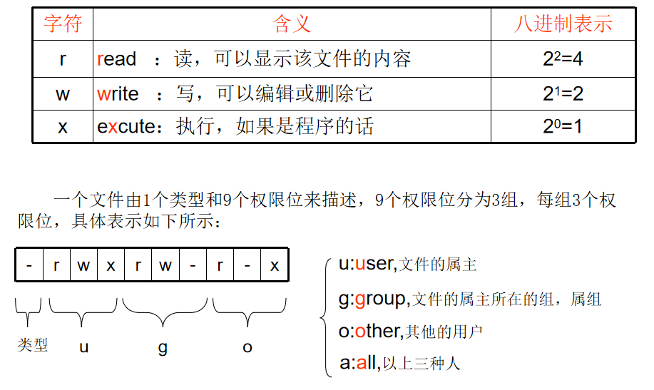
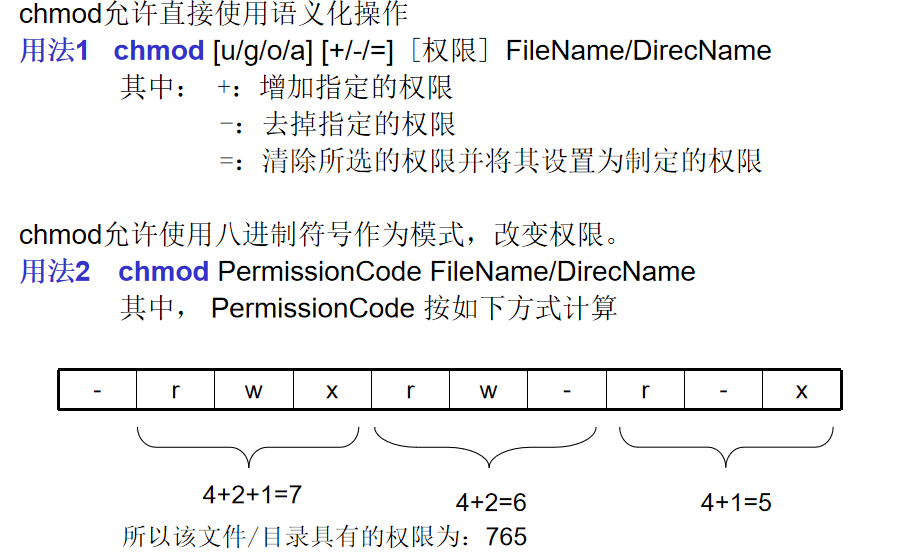
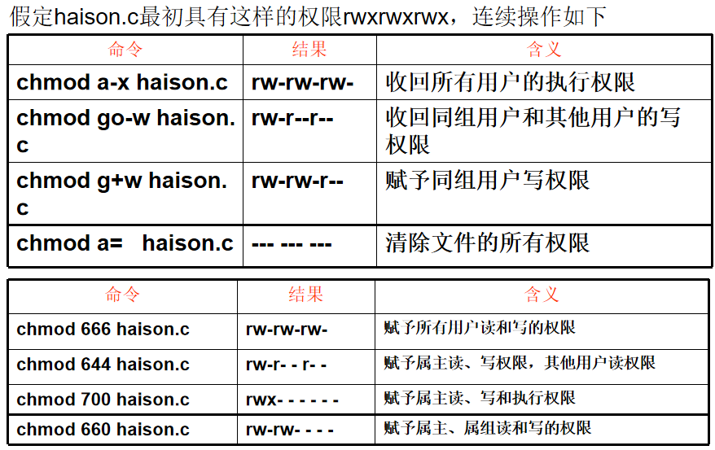

[toc]

# 文件和目录管理

## 01. 查看目录内容

### 1.1 `ls` 命令说明

- `ls` 是英文单词 **list** 的简写，其功能为列出目录的内容，是用户最常用的命令之一，类似于 **DOS** 下的 `dir` 命令

* **Linux 下文件和目录的特点**

- Linux **文件** 或者 **目录** 名称最长可以有 `256` 个字符
- 以 `.` 开头的文件为隐藏文件，需要用 -a 参数才能显示
- **.** 代表当前目录
- **..** 代表上一级目录

### 1.2 ls 常用选项

| 选项 | 含义                                         |
| :--- | :------------------------------------------- |
| -a   | 显示指定目录下所有子目录与文件，包括隐藏文件 |
| -l   | 以列表方式显示文件的详细信息                 |
| -h   | 配合 -l 以人性化的方式显示文件大小           |
| -r   |                                              |
| -t   |                                              |
| -i   |                                              |

* `ls -l` 常常缩写为 `ll`

### 1.3 ls 通配符的使用

* 什么时候会用到通配符？
  * 所要显示的目录下的文件数目众多，单纯的`ls` 会刷刷刷显示好几屏时。

| 通配符 | 含义                                 |
| :----- | :----------------------------------- |
| *      | 代表任意个数个字符                   |
| ?      | 代表任意一个字符，至少 1 个          |
| []     | 表示可以匹配字符组中的任一一个       |
| [abc]  | 匹配 a、b、c 中的任意一个            |
| [a-f]  | 匹配从 a 到 f 范围内的的任意一个字符 |


## 02. 显示和切换目录

### 2.0 命令概览

| 命令 | 功能             |
| ---- | ---------------- |
| pwd  | 显示当前工作路径 |
| tree | 显示目录树       |
| cd   | 切换到指定目录   |

### 2.1 `pwd`

* 显示当前工作路径

### 2.2 `tree`

* 显示目录树
* Ubuntu下如果出现乱码，执行`alias tree='tree -charset ASCII'`即可。

### 2.3 `cd`

- `cd` 是英文单词 **change directory** 的简写，其功能为更改当前的工作目录，也是用户最常用的命令之一

> 注意：Linux 所有的 **目录** 和 **文件名** 都是大小写敏感的

| 命令  | 含义                                   |
| :---- | :------------------------------------- |
| cd    | 切换到当前用户的主目录(/home/用户目录) |
| cd ~  | 切换到当前用户的主目录(/home/用户目录) |
| cd .  | 保持在当前目录不变                     |
| cd .. | 切换到上级目录                         |
| cd -  | 可以在最近两次工作目录之间来回切换     |

### 2.4 相对路径和绝对路径

- **相对路径** 在输入路径时，最前面不是 **/** 或者 **~**，表示相对 **当前目录** 所在的目录位置
- **绝对路径** 在输入路径时，最前面是 **/** 或者 **~**，表示从 **根目录/家目录** 开始的具体目录位置

### 2.5 linux目录结构


## 03. 创建和删除操作

### 3.0 命令概览

| 命令  | 英文           | 功能                        |
| ----- | -------------- | --------------------------- |
| touch | touch          | 创建文件；修改文件/目录时间 |
| mkdir | make directory | 创建一个新的目录            |
| rm    | remove         | 删除文件或目录              |

### 3.1 `touch`

- 创建文件或修改文件时间
  - 如果文件 **不存在**，可以创建一个空白文件
  - 如果文件/目录 **已经存在**，可以修改文件/目录的末次修改日期

### 3.2 `mkdir`

- 创建一个新的目录

| 选项 | 含义             |
| :--- | :--------------- |
| -p   | 可以递归创建目录 |

> **新建目录的名称** 不能与当前目录中 **已有的目录或文件** 同名

```bash
mkdir dir  # 创建一个名为dir目录

mkdir -p dir1/dir2/dir3  # 递归创建
```

### 3.3 `rm`

- 删除文件或目录

> 使用 `rm` 命令要小心，因为文件删除后不能恢复

| 选项 | 含义                                                  |
| :--- | :---------------------------------------------------- |
| -f   | 强制删除，忽略不存在的文件，无需提示                  |
| -r   | 递归地删除目录下的内容，**删除文件夹** 时必须加此参数 |

> *如何亲手毁掉Linux系统？*
>
> `sudo rm -rf /*`

## 04. 拷贝和移动文件

### 4.0 命令概览

| 序号 | 命令               | 对应英文 | 作用                                 |
| :--- | :----------------- | :------- | :----------------------------------- |
| 01   | tree [目录名]      | tree     | 以树状图列出文件目录结构             |
| 02   | cp 源文件 目标文件 | copy     | 复制文件或者目录                     |
| 03   | mv 源文件 目标文件 | move     | 移动文件或者目录／文件或者目录重命名 |


### 4.1 `tree`

* 参数一览

| 选项 | 含义       |
| ---- | ---------- |
| -d   | 只显示目录 |

### 4.2 `cp`

* `cp` 命令的功能是将给出的 **文件** 或 **目录** 复制到另一个 **文件** 或 **目录** 中，相当于 **DOS** 下的 `copy` 命令

* 选项一览

| 参数 | 说明                                                         |
| ---- | ------------------------------------------------------------ |
| -r   | 若给出的源文件是目录文件，则 cp 将递归复制该目录下的所有子目录和文件，目标文件必须为一个目录名 |
| -a   |                                                              |
| -i   | 覆盖文件前提示                                               |
| -v   |                                                              |
* 举例

```bash
cp file1.txt file2.txt  # 将file1.txt文件复制为file2.txt 文件

cp -r dir1/ dir2/  # 分情况讨论
# 1.如果dir2不存在，将dir1目录复制为dir2目录
# 2.如果dir2存在，则将dir1复制到dir2目录下
```

### 4.3 `mv`

* `mv` 命令可以用来 **移动** **文件** 或 **目录**，也可以给 **文件或目录重命名**

* 参数一览

| 选项 | 含义           |
| ---- | -------------- |
| -i   | 覆盖文件前提示 |
| -f   |                |
| -b   |                |

* 举例


```bash
mv file.txt dir/  # 将file.txt文件移动到dir目录下
mv dir1 dir2  # 将dir1目录重命名为dir2目录
```


## 05. 查看文件内容

### 5.0 命令概览

| 序号 | 命令                    | 作用                                                 |
| :--- | :---------------------- | :--------------------------------------------------- |
| 01   | cat [bnETvn] 文件名     | 查看文件内容、创建文件、文件合并、追加文件内容等功能 |
| 02   | tac                     | 从最后一行开始显示                                   |
| 03   | nl [-bnw] 文件名        | 添加行号显示，可对行号进行更细致的格式控制           |
| 04   | more 文件名             | 分屏显示文件内容，看到末尾自行结束                   |
| 05   | less                    | 分屏显示文件内容，看到末尾还可向前滚屏，更强大！     |
| 06   | head [-n number] 文件名 | 只显示开头的几行                                     |
| 07   | tail [-n number] 文件名 | 只显示末尾的几行                                     |
| 08   | od                      | 以二进制方式读取文件内容                             |
| 09   | wc                      | 显示文件统计信息                                     |

### 5.1 `cat`

* 对应英文：concatenate

- `cat` 命令可以用来 **查看文件内容**、**创建文件**、**文件合并**、**追加文件内容** 等功能
- `cat` 会一次显示所有的内容，适合 **查看内容较少** 的文本文件

| 选项   | 含义                                           |
| :----- | :--------------------------------------------- |
| **-b** | 打印行号，仅针对非空白行做行号显示，空白行略过 |
| **-n** | 打印所有行的行号，包括空白行                   |
| -E     | 将结尾的换行符`$` 显示出来                     |
| -T     | 将`tab` 键以`^I` 显示出来                      |
| -v     | 列出一些看不出来的特殊字符                     |
| -A     | 相当于 -vET的整合选项                          |

> Linux 中还有一个 `nl` 的命令和 `cat -b` 的效果等价

### 5.2 `more`

- `more` 命令可以用于分屏显示文件内容，每次只显示一页内容
- 适合于 **查看内容较多**的文本文件

使用 `more` 的操作键：

| 操作键   | 功能                 |
| :------- | :------------------- |
| 空格键   | 显示手册页的下一屏   |
| Enter 键 | 一次滚动手册页的一行 |
| b        | 回滚一屏             |
| f        | 前滚一屏             |
| q        | 退出                 |
| /word    | 搜索 **word** 字符串 |

### 5.3 `less`

* `less` 命令的命名充分体现了该命令作者的叛逆精神，只为和`more` “对着干”
* `less` 比 `more`更强大
  * `less` 有更多的功能键
  * 当滚屏到最后一屏时，`more`的显示自动结束，而`less` 还可以往前滚

| 操作键     | 功能                             |
| ---------- | -------------------------------- |
| 空格键     | 向下翻动一页                     |
| [pagedown] | 向下翻动一页                     |
| [pageup]   | 向上翻动一页                     |
| /字符串    | 向下查找字符串                   |
| ?字符串    | 向上查找字符串                   |
| n          | 重复前一个查找（与/或?有关）     |
| N          | 反向重复前一个查找（与/或?有关） |
| g          | 调到第一行                       |
| G          | 调到最后一行                     |
|q|退出|


## 06.查找、匹配和排序

### 6.0 命令概览

| 序号 | 命令            | 作用                       |
| ---- | --------------- | -------------------------- |
| 01   | which           | 查找执行命令               |
| 02   | find            |                            |
| 03   | whereis         | 在一些特定的目录中查找文件 |
| 04   | locate/updatedb |                            |
| 05   | grep            |                            |
| 07   | sort            |                            |


### 6.1 `grep`

- Linux 系统中 `grep` 命令是一种强大的文本搜索工具
- `grep`允许对文本文件进行 **模式**查找，即支持正则表达式。

| 选项 | 含义                                     |
| :--- | :--------------------------------------- |
| -n   | 显示匹配行及行号                         |
| -v   | 显示不包含匹配文本的所有行（相当于求反） |
| -i   | 忽略大小写                               |

- 常用的两种模式查找

| 参数 | 含义                         |
| :--- | :--------------------------- |
| ^a   | 行首，搜寻以 **a** 开头的行  |
| ke$  | 行尾，搜寻以 **ke** 结束的行 |


## 07.文件内容比较

### 7.0 命令概览

| 序号 | 命令 | 功能                                                   |
| ---- | ---- | ------------------------------------------------------ |
| 01   | uniq | 显示文件中所有不重复的行，单个或多个文件均可           |
| 02   | comm | 对两个已经排好序的文件进行逐行比较，只显示它们共有的行 |
| 03   | diff | 比较两个文件的不同之处                                 |


## 08.文件压缩与解压

### 8.0 命令概览

| 序号 | 命令  | 功能 |
| ---- | ----- | ---- |
|      | gzip  |      |
|      | unzip |      |
|      | tar   |      |

## 09.权限管理

### 9.0 命令概览

| 命令  | 功能                  |
| ----- | --------------------- |
| chmod | 改变文件或目录的权限  |
| chown | 更改文件/目录所有者   |
| chgrp | 更改问价/目录的所属组 |
| umask |                       |

### 9.1 Linux文件权限概念(★★★)

* 文件权限概念



* 文件类型

| 符号 | 代表的文件类型 |
| ---- | -------------- |
| -    | 普通文件       |
| d    | 目录文件       |
| p    | 管道文件       |
| l    | 链接文件       |
| b    | 块设备文件     |
| c    | 字符设备文件   |
| s    | 套接字文件     |


### 9.2 `chmod`(★★★)

* chmod的两种用法



* 举例



```bash
chmod u=rwx,go=rx file1.txt
```


### 9.3 `chown`

* 修改文件或目录的所有者和所属的组
* 命令格式

```bash
chown [选项] 所有者 文件或目录
chown [选项] 所有者:所属组 文件或目录  # 一次性完成修改所有者和所属组
```

* 选项

| 选项 | 含义                                               |
| ---- | -------------------------------------------------- |
| -R   | 递归修改所有子目录的权限（若不加，子目录权限不变） |

### 9.4 `chgrp`

* 修改所属组

* 选项

| 选项 | 含义                                               |
| ---- | -------------------------------------------------- |
| -R   | 递归修改所有子目录的权限（若不加，子目录权限不变） |


### 9.5 `umask`


## 10. 其他

### 10.1 `echo 文字内容`

- `echo` 会在终端中显示参数指定的文字，通常会和 **重定向** 联合使用

### 10.2 重定向 `>` 和 `>>`

- Linux 允许将命令执行结果 **重定向**到一个 **文件**
- 将本应显示在**终端上的内容** **输出／追加** 到**指定文件中**

其中

- `>` 表示输出，会覆盖文件原有的内容
- `>>` 表示追加，会将内容追加到已有文件的末尾

### 10.3 管道 `|`

- Linux 允许将 **一个命令的输出** 可以**通过管道** 做为 **另一个命令的输入**
- 可以理解现实生活中的管子，管子的一头塞东西进去，另一头取出来，这里 `|` 的左右分为两端，左端塞东西（写），右端取东西（读）

常用的管道命令有：

- `more`：分屏显示内容
- `grep`：在命令执行结果的基础上查询指定的文本