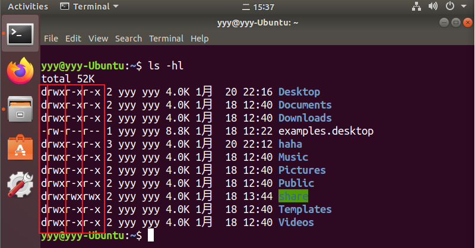
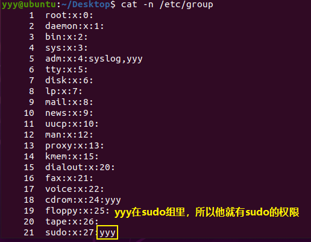
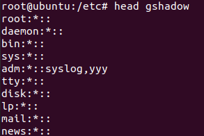
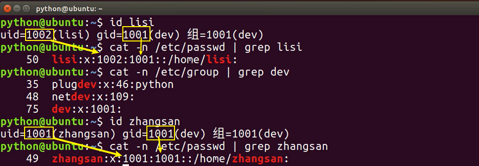
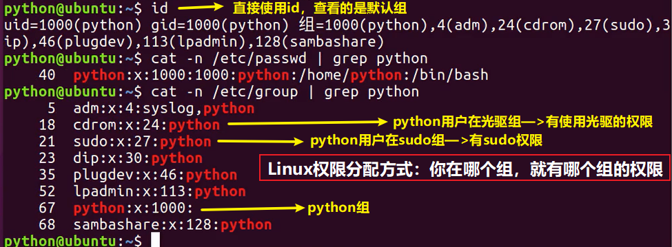
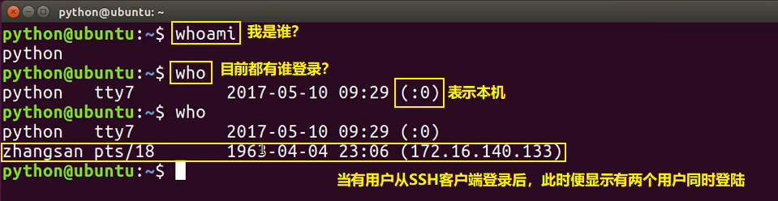

[toc]

# 用户和组管理

## 01. 用户和权限的基本概念

### 1.1 基本概念

- Linux是典型的**多用户多任务**的操作系统，因此**用户管理** 是 Linux 系统工作中重要的一环，用户管理包括 **用户** 与 **组** 管理
- 在 Linux 系统中，不论是由本机或是远程登录系统，每个系统都**必须拥有一个账号**，并且**对于不同的系统资源拥有不同的使用权限**
- 在 Linux 中，可以指定 **每一个用户** 针对 **不同的文件或者目录** 的 **不同权限**
- 对 **文件／目录** 的权限包括：

| 序号 | 权限 |  英文  | 缩写 | 数字代号 |
| :--: | :--: | :----: | :--: | :------: |
|  01  |  读  |  read  |  r   |    4     |
|  02  |  写  | write  |  w   |    2     |
|  03  | 执行 | excute |  x   |    1     |

### 1.2 组

- 为了方便用户管理，提出了 **组** 的概念，如下图所示


- 在实际应用中，可以预先针对 **组** 设置好权限，然后 **将不同的用户添加到对应的组中**，被添加入组的用户相应的就拥有改组的权限，从而**不用依次为每一个用户设置权限**

### 1.3 ls -l 扩展

- `ls -l` 可以查看文件夹下文件的详细信息，从左到右依次是：

  - **权限**，第 1 个字符如果是 `d` 表示目录
  - **硬链接数**，通俗地讲，就是有多少种方式，可以访问到当前目录／文件
  - **拥有者**，家目录下 文件／目录 的拥有者通常都是当前用户
  - **组**，在 Linux 中，很多时候，会出现组名和用户名相同的情况，后续会讲
  - **大小**
  - **时间**
  - **名称**

  

### 1.4 超级用户

- Linux 系统中的 `root` 账号通常 **用于系统的维护和管理**，对操作系统的所有资源 **具有所有访问权限**
- 在大多数版本的 Linux 中，都不推荐 **直接使用 root 账号登录系统**
- 在 Linux 安装的过程中，系统会自动创建一个用户账号，而这个默认的用户就称为“标准用户”

#### sudo

- `su` 是 `substitute user` 的缩写，表示 **使用另一个用户的身份**
- `sudo` 命令用来以其他身份来执行命令，预设的身份为 `root`
- 用户使用 `sudo` 时，必须先输入密码，之后有 **5 分钟的有效期限**，超过期限则必须重新输入密码

> 若其未经授权的用户企图使用 `sudo`，则会发出警告邮件给管理员

## 02. 组管理

### 2.0 命令概览

> 提示：**创建组** / **删除组** 的终端命令都需要通过 `sudo` 执行

| 序号 | 命令                            | 作用                      |
| :--- | :------------------------------ | :------------------------ |
| 01   | groupadd 组名                   | 添加组                    |
| 02   | groupdel 组名                   | 删除组                    |
| 03   | groupmod [options] 组名         | 修改组名或组ID            |
| 04   | gpasswd [options] [用户名] 组名 |                           |
| 05   | cat /etc/group                  | 确认组信息                |
| 06   | chgrp -R 组名 文件/目录名       | 递归修改文件/目录的所属组 |

### 2.1 组的概念

- 为了方便用户管理，提出了 **组** 的概念，如下图所示


- 在实际应用中，可以预先针对 **组** 设置好权限，然后 **将不同的用户添加到对应的组中**，被添加入组的用户相应的就拥有改组的权限，从而**不用依次为每一个用户设置权限**
- Linux的组有**私有组**、**系统组**、**标准组**之分。
  - **私有组**：建立帐户时，若没有指定帐户所属的组，系统会建立一个组名和用户名相同的组，这个组就是私有组
  - **标准组**：标准组可以容纳多个用户，组中的用户都具有该组所拥有的权利
  - **系统组**：Linux系统正常运行所必须的，安装Linux系统或添加新的软件包会自动建立系统组

### 2.2 组信息文件——`/etc/group`

* 组信息保存在 `/etc/group` 文件中
* 文件字段：groupname:passwd:GID:userlist

| groupname | passwd       | GID      | userlist             |
| --------- | ------------ | -------- | -------------------- |
| 组的名字  | 组的加密口令 | 组的编号 | 该组所拥有的成员列表 |

* 查看 `etc/group` 文件



### 2.3 组密码文件——`etc/gshadow`

* 组的密码、管理员等信息保存在`/etc/gshadow`中
* 该文件只有root用户可以读取
* 文件字段：groupname: Encrypted password: Group administrators: Group members

| groupname | Encrypted password | Group administrators | Group members |
| --------- | ------------------ | -------------------- | ------------- |
| 组名      | 加密密码           | 组的管理员           | 组成员        |

* 查看`/etc/gshadow` 文件



### 2.4 `groupadd`

* 命令作用：添加一个组
* 命令格式：`groupadd [options] 组名`
* 常用选项

| 选项   | 含义                                                         |
| ------ | ------------------------------------------------------------ |
| -g GID | 指定新组的GID，默认值是已有的最大GID加1                      |
| -r     | 建立一个系统专用组，则分配一个1-100的GID。与-g不同时使用时。 |

### 2.5 `groupdel`

* 命令作用：删除指定的组账号。若该群组中仍包括某些用户，则必须先删除这些用户后，方能删除群组。

### 2.6 `groupmod`

* 命令作用：修改组ID或组名
* 常用选项

| 选项      | 含义     |
| --------- | -------- |
| -g 新组号 | 修改组ID |
| -n 新组名 | 修改组名 |

* 举例

```bash
grep lbgroup /etc/group  # 查询group文件中lbgroup组属性

groupmod –g 503 lbgroup  # 改变lbgroup组的GID为503
grep lbgroup /etc/group  # 查询操作结果是否正确

groupmod –n ydgroup lbgroup  # 改变lbgroup组名为ydgroup
grep 503  /etc/group  # 查询操作结果是否正确
```

### 2.7 `gpasswd`


### 2.8 实战演练

1. 在 `python` 用户的桌面文件夹下创建 `Python学习` 目录
2. 新建 `dev` 组
3. 将 `Python学习` 目录的组修改为 `dev`

```bash
mkdir Python学习 # 创建目录
sudo groupadd dev # 创建组
sudo chgrp -R dev Python学习/ # 修改目录所属组(注意使用"-R"选项)
```


## 03. 用户管理

> 提示：**创建用户** / **删除用户** / **修改其他用户密码** 的终端命令都需要通过 `sudo` 执行

### 3.0 命令概览

| 序号 | 命令                           | 作用                 | 说明                                                         |
| :--- | :----------------------------- | :------------------- | :----------------------------------------------------------- |
| 01   | useradd -m -g 组 新建用户名    | 添加新用户           | -m 自动建立用户家目录-g 指定用户所在的组，否则会建立一个和同名的组 |
| 02   | passwd 用户名                  | 设置用户密码         | 如果是普通用户，直接用 passwd 可以修改自己的账户密码         |
| 03   | userdel -r 用户名              | 删除用户             | -r 选项会自动删除用户家目录                                  |
| 04   | cat /etc/passwd \| grep 用户名 | 确认用户信息         | 新建用户后，用户信息会保存在 /etc/passwd 文件中              |
| 05   | id [用户名]                    | 查看用户UID和GID     | 如不加用户名，则查看当前用户的ID                             |
| 06   | who                            | 查看当前登录用户列表 |                                                              |
| 07   | whoami                         | 查看当前登录账户信息 |                                                              |

> 提示：
>
> - 创建用户时，如果忘记添加 `-m` 选项指定新用户的家目录 —— 最简单的方法就是**删除用户，重新创建**
> - 创建用户时，默认会创建一个和**用户名**同名的**组名**
> - 用户信息保存在 `/etc/passwd` 文件中

### 3.1 用户的概念

* Linux下的用户可以分为三类，每个用户都有自己一个编号，成为UID

  * 超级用户（UID=0）
  * 系统用户（UID：1-499）
  * 普通用户（UID：500-60000）

  

### 3.2 用户信息文件——`etc/passwd`

* `passwd`是一个文本文件，它位于`/etc`目录下，用于定义系统的用户账号，每行定义一个用户账号，一行又分为不同的字段，字段之间用 ”:“ 分隔。
* 由于所有用户都对`passwd`有读权限，所以该文件中指定以用户账号，而不保存密码。

* `passwd`文件7个字段的含义

  | 字段      | 说明                                                         |
  | --------- | ------------------------------------------------------------ |
  | Account   | 用户名。不能包含大写字母！                                   |
  | Password  | 用户密码。处于安全，现已不用改字段保存密码，而用“x”填充。真正的密码保存在shadow文件中 |
  | UID       | 用户ID                                                       |
  | GID       | 用户所属的主组ID                                             |
  | GECOS     | 该字段是可选的，通常用于保存用户命名的信息                   |
  | Directory | 用户家目录                                                   |
  | Shell     | 用户使用的Shell                                              |

* 关于Shell：Shell是一类软件，这类软件是可以输入并执行终端命令的窗口。`ubuntu` 默认是 `dash`。（之所以默认是`dash`，是因为它比`bash`快。但是！它有一个很致命的缺陷！就是在Window的XShell中显示贼不友好，首先是不显示用户名、机器名和当前目录（只有一个$符）；其次用ls时，列出的文件和目录全是黑色，无法辨识；再次，当按`上/下`键时，历史命令是一堆乱码，等等。）

### 3.3 用户密码文件——`etc/shadow`

* /etc/shadow 文件，用于存储 Linux 系统中用户的密码信息，又称为“影子文件”。
* 前面介绍了 /etc/passwd 文件，由于该文件允许所有用户读取，易导致用户密码泄露，因此 Linux 系统将用户的密码信息从 /etc/passwd 文件中分离出来，并单独放到了此文件中。
* /etc/shadow 文件只有 root 用户拥有读权限，其他用户没有任何权限，这样就保证了用户密码的安全性。
* 9个字段各自含义

| 字段                   | 含义                                                         |
| ---------------------- | ------------------------------------------------------------ |
| 用户名                 |                                                              |
| 加密密码               | 这里保存的是真正的加密密码                                   |
| 最后一次修改时间       | 最后一次修改密码的时间（按到 1971 年 1 月 1 日的天数显示）   |
| 最小修改时间间隔       | 最小修改间隔时间，也就是说，该字段规定了从第 3 字段（最后一次修改密码的日期）起，多长时间之内不能修改密码。如果是 0，则密码可以随时修改；如果是 10，则代表密码修改后 10 天之内不能再次修改密码。此字段是为了针对某些人频繁更改账户密码而设计的。 |
| 密码有效期             | 经常变更密码是个好习惯，为了强制要求用户变更密码，这个字段可以指定距离第 3 字段（最后一次更改密码）多长时间内需要再次变更密码，否则该账户密码进行过期阶段。该字段的默认值为 99999，也就是 273 年，可认为是永久生效。如果改为 90，则表示密码被修改 90 天之后必须再次修改，否则该用户即将过期。管理服务器时，通过这个字段强制用户定期修改密码。 |
| 密码需要变更的警告天数 | 与第 5 字段相比较，当账户密码有效期快到时，系统会发出警告信息给此账户，提醒用户 "再过 n 天你的密码就要过期了，请尽快重新设置你的密码！"。该字段的默认值是 7，也就是说，距离密码有效期的第 7 天开始，每次登录系统都会向该账户发出 "修改密码" 的警告信息。 |
| 密码过期后的宽限天数   | 也称为“口令失效日”，简单理解就是，在密码过期后，用户如果还是没有修改密码，则在此字段规定的宽限天数内，用户还是可以登录系统的；如果过了宽限天数，系统将不再让此账户登陆，也不会提示账户过期，是完全禁用。比如说，此字段规定的宽限天数是 10，则代表密码过期 10 天后失效；如果是 0，则代表密码过期后立即失效；如果是 -1，则代表密码永远不会失效。 |
| 账号失效时间           | 同第 3 个字段一样，使用自 1970 年 1 月 1 日以来的总天数作为账户的失效时间。该字段表示，账号在此字段规定的时间之外，不论你的密码是否过期，都将无法使用！该字段通常被使用在具有收费服务的系统中。这个字段目前没有使用，等待新功能的加入。 |
| 保留字段               | 这个字段目前没有使用，等待新功能的加入。                     |

* 忘记密码怎么办？
  * 对于普通账户的密码遗失，可以通过 root 账户解决，它会重新给你配置好指定账户的密码，而不需知道你原有的密码（利用 root 的身份使用 passwd 命令即可）。
  * 如果 root 账号的密码遗失，则需要重新启动进入单用户模式，系统会提供 root 权限的 bash 接口，此时可以用 passwd 命令修改账户密码；也可以通过挂载根目录，修改 /etc/shadow，将账户的 root 密码清空的方法，此方式可使用 root 无需密码即可登陆，建议登陆后使用 passwd 命令配置 root 密码。

### 3.4 `useradd`

* 选项列表

| 选项        | 说明 | 含义                                                         |
| ----------- | ---- | ------------------------------------------------------------ |
| -d 主目录   |      | 手工指定用户的主目录。主目录必须写绝对路径，而且如果需要手工指定主目录，则一定要注意权限； |
| -m          | 常用 | 建立用户时强制建立用户的家目录。在建立系统用户时，该选项是默认的； |
| -u UID      |      | 手工指定用户的 UID，注意 UID 的范围（不要小于 500）。        |
| -r | | 创建系统用户，也就是 UID 在 1~499 之间，供系统程序使用的用户。由于系统用户主要用于运行系统所需服务的权限配置，因此系统用户的创建默认不会创建主目录。 |
| -o | | 允许创建的用户的 UID 相同。例如，执行 "useradd -u 0 -o usertest" 命令建立用户 usertest，它的 UID 和 root 用户的 UID 相同，都是 0； |
| -c 用户说明 |      | 手工指定/etc/passwd文件中各用户信息中第 5 个字段的描述性内容，可随意配置； |
| -g 组名     |      | 手工指定用户的初始组。一般以和用户名相同的组作为用户的初始组，在创建用户时会默认建立初始组。一旦手动指定，则系统将不会在创建此默认的初始组目录。 |
| -G 组名     |      | 指定用户的附加组。我们把用户加入其他组，一般都使用附加组；   |
| -s shell    |      | 手工指定用户的登录 Shell，默认是 /bin/bash；                 |
| -e 曰期     |      | 指定用户的失效曰期，格式为 "YYYY-MM-DD"。也就是 /etc/shadow 文件的第八个字段； |

* 使用useradd 建立新用户时，新建的用户有一定的默认设置，这个设置来自`/etc/default/useradd`文件，文件中的内容如下

```bash
[root@localhost ~]#vim /etc/default/useradd
# useradd defaults file
GR0UP=100
HOME=/home
INACTIVE=-1
EXPIRE=
SHELL=/bin/bash
SKEL=/etc/skel
CREATE_MAIL_SPOOL=yes
```

* 另外，也可以直接通过使用命令进行查看

```bash
[root@localhost ~]# useradd -D
GROUP=100
HOME=/home
INACTIVE=-1
EXPIRE=
SHELL=/bin/bash
SKEL=/etc/skel
CREATE_MAIL_SPOOL=yes
```

### 3.5 `passwd`

* 学习 useradd 命令我们知道，使用此命令创建新用户时，并没有设定用户密码，因此还无法用来登陆系统，下面就来学习 passwd 密码配置命令 。
* 命令格式：`passwd [options] 用户名`
* 选项说明

| 选项    | 含义                                                         |
| ------- | ------------------------------------------------------------ |
| -S      | 查询用户密码的状态，也就是 /etc/shadow 文件中此用户密码的内容。仅 root 用户可用； |
| -l      | 暂时锁定用户，该选项会在 /etc/shadow 文件中指定用户的加密密码串前添加 "!"，使密码失效。仅 root 用户可用； |
| -u      | 解锁用户，和 -l 选项相对应，也是只能 root 用户使用；         |
| --stdin | 可以将通过管道符输出的数据作为用户的密码。主要在批量添加用户时使用； |
| -n 天数 | 设置该用户修改密码后，多长时间不能再次修改密码，也就是修改 /etc/shadow 文件中各行密码的第 4 个字段； |
| -x 天数 | 设置该用户的密码有效期，对应 /etc/shadow 文件中各行密码的第 5 个字段； |
| -w 天数 | 设置用户密码过期前的警告天数，对于 /etc/shadow 文件中各行密码的第 6 个字段； |
| -i 日期 | 设置用户密码失效日期，对应 /etc/shadow 文件中各行密码的第 7 个字段。 |

> 提示
>
> - `/etc/passwd` 是用于保存用户信息的文件
> - `/usr/bin/passwd` 是用于修改用户密码的程序

### 3.6 `userdel`

* 通过前面的学习我们知道，用户的相关数据包含如下几项，userdel 命令的作用就是从以下文件中，删除与指定用户有关的数据信息。
  * 用户基本信息：存储在 /etc/passwd 文件中；
  * 用户密码信息：存储在 /etc/shadow 文件中；
  * 用户群组基本信息：存储在 /etc/group 文件中；
  * 用户群组信息信息：存储在 /etc/gshadow 文件中；
  * 用户个人文件：主目录默认位于 /home/用户名，邮箱位于 /var/spool/mail/用户名。
* 命令格式 

```bash
userdel -r 用户名  # -r 选项表示在删除用户的同时删除用户的家目录。
# 注意，在删除用户的同时如果不删除用户的家目录，那么家目录就会变成没有属主和属组的目录，也就是垃圾文件。
```

### 3.7 `usermod`

* 命令作用：对于已经存在的用户，修改其信息
* 命令格式：`usermod [options] 用户名`

* 选项说明

| 选项        | 含义                                                         |
| ----------- | ------------------------------------------------------------ |
| -c 用户说明 | 修改用户的说明信息，即修改 /etc/passwd 文件目标用户信息的第 5 个字段； |
| -d 主目录   | 修改用户的主目录，即修改 /etc/passwd 文件中目标用户信息的第 6 个字段，需要注意的是，主目录必须写绝对路径； |
| -e 日期     | 修改用户的失效曰期，格式为 "YYYY-MM-DD"，即修改 /etc/shadow 文件目标用户密码信息的第 8 个字段； |
| -g 组名     | 修改用户的初始组，即修改 /etc/passwd 文件目标用户信息的第 4 个字段（GID）； |
| -u UID      | 修改用户的UID，即修改 /etc/passwd 文件目标用户信息的第 3 个字段（UID）； |
| -G 组名     | 修改用户的附加组，其实就是把用户加入其他用户组，即修改 /etc/group 文件； |
| -l 用户名   | 修改用户名称；                                               |
| -L          | 临时锁定用户（Lock）；                                       |
| -U          | 解锁用户（Unlock），和 -L 对应；                             |
| -s shell    | 修改用户的登录 Shell，默认是 /bin/bash。                     |

### 3.8 查看用户信息

| 序号 | 命令                           | 作用                       |
| :--- | :----------------------------- | :------------------------- |
| 01   | cat /etc/passwd \| grep 用户名 | 查询用户各方面信息         |
| 02   | id [用户名]                    | 查看用户 UID 和 GID 信息   |
| 03   | who                            | 查看当前所有登录的用户列表 |
| 04   | whoami                         | 查看当前登录用户的账户名   |

* 查看普通用户ID



* 查看默认用户ID



* who




### 3.9 切换用户——`su`

* 命令介绍
  * su 是最简单的用户切换命令，通过该命令可以实现任何身份的切换，包括从普通用户切换为 root 用户、从 root 用户切换为普通用户以及普通用户之间的切换。
  * 普通用户之间切换以及普通用户切换至 root 用户，都需要知晓对方的密码，只有正确输入密码，才能实现切换；从 root 用户切换至其他用户，无需知晓对方密码，直接可切换成功。
* 命令格式：`su [options] 用户名`
  * 如果不加用户名则是切换到root
* 选项

| 选项    | 含义                                                         |
| ------- | ------------------------------------------------------------ |
| -       | 当前用户不仅切换为指定用户的身份，同时所用的工作环境也切换为此用户的环境（包括 PATH 变量、MAIL 变量等），使用 - 选项可省略用户名，默认会切换为 root 用户。 |
| -l      | 同 - 的使用类似，也就是在切换用户身份的同时，完整切换工作环境，但后面需要添加欲切换的使用者账号。 |
| -p      | 表示切换为指定用户的身份，但不改变当前的工作环境（不使用切换用户的配置文件）。 |
| -m      | 和 -p 一样；                                                 |
| -c 命令 | 仅切换用户执行一次命令，执行后自动切换回来，该选项后通常会带有要执行的命令。 |

* `su`和`su -` 的区别
  * 注意，使用 su 命令时，有 - 和没有 - 是完全不同的，- 选项表示在切换用户身份的同时，连当前使用的环境变量也切换成指定用户的。我们知道，环境变量是用来定义操作系统环境的，因此如果系统环境没有随用户身份切换，很多命令无法正确执行。
  * 举个例子，普通用户 lamp 通过 su 命令切换成 root 用户，但没有使用 - 选项，这样情况下，虽然看似是 root 用户，但系统中的 `$PATH` 环境变量依然是 lamp 的（而不是 root 的），因此当前工作环境中，并不包含 /sbin、/usr/sbin等超级用户命令的保存路径，这就导致很多管理员命令根本无法使用。不仅如此，当 root 用户接受邮件时，会发现收到的是 lamp 用户的邮件，因为环境变量 `$MAIL` 也没有切换。
  * 初学者可以这样理解它们之间的区别，即有 - 选项，切换用户身份更彻底；反之，只切换了一部分，这会导致某些命令运行出现问题或错误（例如无法使用 service 命令）。