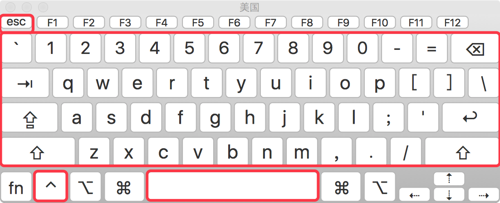
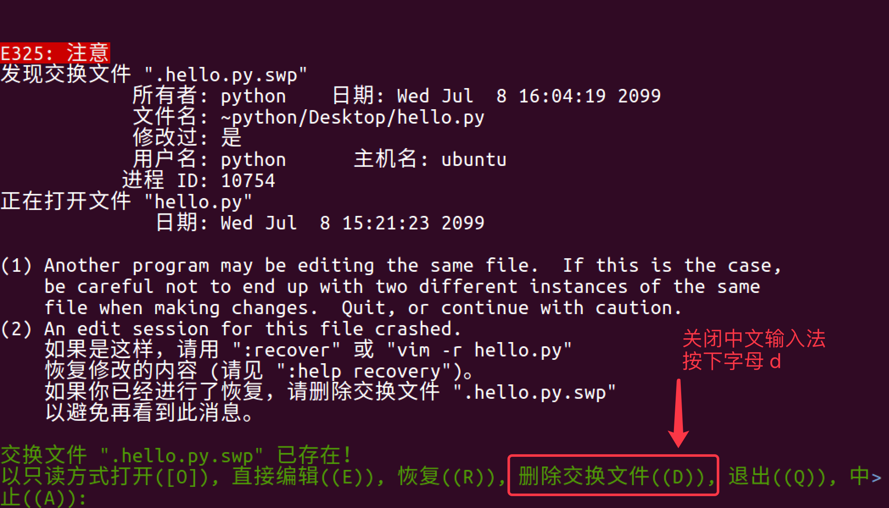
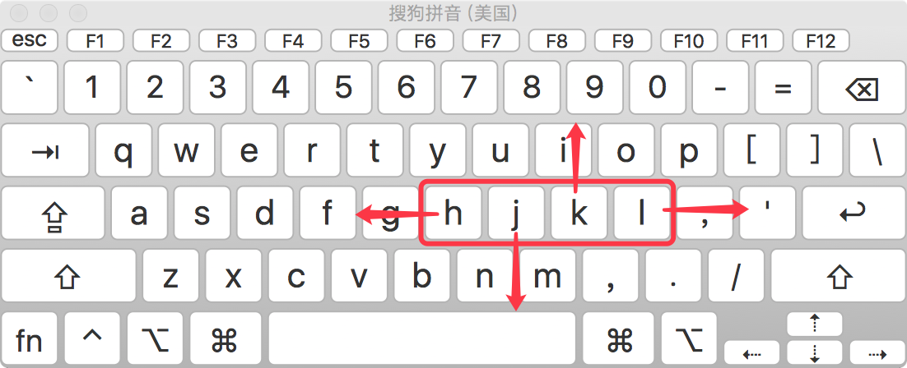
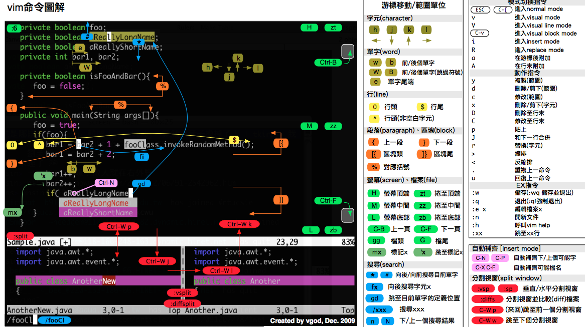

# `vi` —— 终端中的编辑器

## 目标

* `vi` 简介
* 打开和新建文件
* 三种工作模式
* 常用命令
* 分屏命令
* 常用命令速查图

## 01. `vi` 简介

### 1.1 学习 `vi` 的目的

* 在工作中，要对 **服务器** 上的文件进行 **简单** 的修改，可以使用 `ssh` 远程登录到服务器上，并且使用 `vi` 进行快速的编辑即可
* 常见需要修改的文件包括：
    * **源程序**
    * **配置文件**，例如 `ssh` 的配置文件 `~/.ssh/config`
    
> * 在没有图形界面的环境下，要编辑文件，`vi` 是最佳选择！
> * 每一个要使用 Linux 的程序员，都应该或多或少的学习一些 `vi` 的常用命令

### 1.2 vi 和 vim

* 在很多 `Linux` 发行版中，直接把 `vi` 做成 `vim` 的软连接

#### vi

* `vi` 是 `Visual interface` 的简称，是 `Linux` 中 **最经典** 的文本编辑器
* `vi` 的核心设计思想 —— **让程序员的手指始终保持在键盘的核心区域，就能完成所有的编辑操作**



* `vi` 的特点：
    * **没有图形界面** 的 **功能强大** 的编辑器
    * 只能是编辑 **文本内容**，不能对字体、段落进行排版
    * **不支持鼠标操作**
    * **没有菜单**
    * **只有命令**
* `vi` 编辑器在 **系统管理**、**服务器管理** 编辑文件时，**其功能永远不是图形界面的编辑器能比拟的**

#### `vim`

**vim = vi improved**

* `vim` 是从 `vi` 发展出来的一个文本编辑器，支持 **代码补全**、**编译** 及 **错误跳转** 等方便编程的功能特别丰富，在程序员中被广泛使用，被称为 **编辑器之神**

#### 查询软连接命令（知道）

* 在很多 `Linux` 发行版中直接把 `vi` 做成 `vim` 的软连接

```bash
# 查找 vi 的运行文件

$ which vi
$ ls -l /usr/bin/vi
$ ls -l /etc/alternatives/vi
$ ls -l /usr/bin/vim.basic

# 查找 vim 的运行文件
$ which vim
$ ls -l /usr/bin/vim
$ ls -l /etc/alternatives/vim
$ ls -l /usr/bin/vim.basic 
```

## 02. 打开和新建文件

* 在终端中输入 `vi` **在后面跟上文件名** 即可

```bash
$ vi 文件名
```

* 如果文件已经存在，会直接打开该文件
* 如果文件不存在，会新建一个文件

### 2.1 打开文件并且定位行

* 在日常工作中，有可能会遇到 **打开一个文件，并定位到指定行** 的情况
* 例如：在开发时，**知道某一行代码有错误**，可以 **快速定位** 到出错代码的位置

* 这个时候，可以使用以下命令打开文件

```bash
$ vi 文件名 +行数
```

> 提示：如果只带上 `+` 而不指定行号，会直接定位到文件末尾

### 2.2 异常处理

* 如果 `vi` 异常退出，在磁盘上可能会保存有 **交换文件**
* 下次再使用 `vi` 编辑该文件时，会看到以下屏幕信息，按下字母 `d` 可以 **删除交换文件** 即可

> 提示：按下键盘时，注意关闭输入法



## 03. 三种工作模式

* `vi` 有三种基本工作模式：
  
    1. **命令模式**
        * **打开文件首先进入命令模式**，是使用 `vi` 的 **入口**
        * 通过 **命令** 对文件进行常规的编辑操作，例如：**定位**、**翻页**、**复制**、**粘贴**、**删除**……
        * 在其他图形编辑器下，通过 **快捷键** 或者 **鼠标** 实现的操作，都在 **命令模式** 下实现
    2. **末行模式** —— 执行 **保存**、**退出** 等操作 
        * 要退出 `vi` 返回到控制台，需要在末行模式下输入命令
        * **末行模式** 是 `vi` 的 **出口**
    3. **编辑模式** —— 正常的编辑文字
    


> 提示：在 `Touch Bar` 的 Mac 电脑上 ，按 `ESC` 不方便，可以使用 `CTRL + [` 替代

### 末行模式命令

| 命令 | 英文 | 功能 |
| :---: | :---: | --- |
| w | write | 保存 |
| q | quit | 退出，如果没有保存，不允许退出 |
| q! | quit | 强行退出，不保存退出 |
| wq | write & quit | 保存并退出 |
| x |  | 保存并退出 |

## 04. 常用命令

### 命令线路图

0. 重复次数
    * 在命令模式下，**先输入一个数字**，**再跟上一个命令**，可以让该命令 **重复执行指定次数** 
1. 移动和选择（**多练**）
    * `vi` 之所以快，关键在于 **能够快速定位到要编辑的代码行**
    * **移动命令** 能够 和 **编辑操作** 命令 **组合使用**
2. 编辑操作
    * **删除**、**复制**、**粘贴**、**替换**、**缩排**
3. 撤销和重复
4. 查找替换
5. 编辑

#### 学习提示

1. `vi` 的命令较多，**不要期望一下子全部记住**，个别命令忘记了，只是会影响编辑速度而已
2. 在使用 `vi` 命令时，注意 **关闭中文输入法**

### 4.1 移动（基本）

* 要熟练使用 `vi`，首先应该学会怎么在 **命令模式** 下样快速移动光标
* **编辑操作命令**，能够和 **移动命令** 结合在一起使用
  
#### 1) 上、下、左、右

| 命令 | 功能 | 手指 |
| :---: | --- | :---: |
| h | 向左 | 食指 |
| j | 向下 | 食指 |
| k | 向上 | 中指 |
| l | 向右 | 无名指 |



#### 2) 行内移动

| 命令 | 英文 | 功能 |
| :---: | :---: | --- |
| w | word | 向后移动一个单词 |
| b | back | 向前移动一个单词 |
| 0 | | 行首 |
| ^ | | 行首，第一个不是空白字符的位置 |
| $ | | 行尾 |

#### 3) 行数移动

| 命令 | 英文 | 功能 |
| :---: | :---: | --- |
| gg | go | 文件顶部 |
| G | go | 文件末尾 |
| 数字gg | go | 移动到 数字 对应行数 |
| 数字G | go | 移动到 数字 对应行数 |
| :数字 |  | 移动到 数字 对应行数 |

#### 4) 屏幕移动

| 命令 | 英文 | 功能 |
| :---: | :---: | --- |
| Ctrl + b | back | 向上翻页 |
| Ctrl + f | forward | 向下翻页 |
| H | Head | 屏幕顶部 |
| M | Middle | 屏幕中间 |
| L | Low | 屏幕底部 |

### 4.2 移动（程序）

#### 1) 段落移动

* `vi` 中使用 空行 来区分段落
* 在程序开发时，通常 **一段功能相关的代码会写在一起** —— 之间没有空行

| 命令 | 功能 |
| :---: | --- |
| { | 上一段 |
| } | 下一段 |

#### 2) 括号切换

* 在程序世界中，`()`、`[]`、`{}` 使用频率很高，而且 **都是成对出现的**

| 命令 | 功能 |
| :---: | --- |
| % | 括号匹配及切换 |

#### 3) 标记

* 在开发时，某一块代码可能**需要稍后处理**，例如：编辑、查看
* 此时先使用 `m` 增加一个标记，这样可以 **在需要时快速地跳转回来** 或者 **执行其他编辑操作**
* **标记名称** 可以是 `a~z` 或者 `A~Z` 之间的任意 **一个** 字母
* 添加了标记的 **行如果被删除**，**标记同时被删除**
* 如果 **在其他行添加了相同名称的标记**，**之前添加的标记也会被替换掉**

| 命令 | 英文 | 功能 |
| :---: | :---: | --- |
| mx | mark | 添加标记 x，x 是 a~z 或者 A~Z 之间的任意一个字母 |
| 'x |  | 直接定位到标记 x 所在位置 |

### 4.3 选中文本（可视模式）

* 学习 `复制` 命令前，应该先学会 **怎么样选中 要复制的代码**
* 在 `vi` 中要选择文本，需要先使用 `Visual` 命令切换到 **可视模式**
* `vi` 中提供了 **三种** 可视模式，可以方便程序员选择 **选中文本的方式**
* 按 `ESC` 可以放弃选中，返回到 **命令模式**

| 命令 | 模式 | 功能 |
| :---: | --- | --- |
| v | 可视模式 | 从光标位置开始按照正常模式选择文本 |
| V | 可视行模式 | 选中光标经过的完整行 |
| Ctrl + v | 可视块模式 | 垂直方向选中文本 |

* **可视模式**下，可以和 **移动命令** 连用，例如：`ggVG` 能够选中所有内容

### 4.4 撤销和恢复撤销

* 在学习编辑命令之前，先要知道怎样撤销之前一次 **错误的** 编辑动作！

| 命令 | 英文 | 功能 |
| :---: | :---: | --- |
| u | undo | 撤销上次命令 |
| CTRL + r | redo | 恢复撤销的命令 |

### 4.5 删除文本

| 命令 | 英文 | 功能 |
| :---: | :---: | --- |
| x | cut | 删除光标所在字符，或者选中文字 |
| d(移动命令) | delete | 删除移动命令对应的内容 |
| dd | delete | 删除光标所在行，可以 ndd 删除多行 |
| D | delete | 删除至行尾 |

> 提示：如果使用 **可视模式** 已经选中了一段文本，那么无论使用 `d` 还是 `x`，都可以删除选中文本

* 删除命令可以和 **移动命令** 连用，以下是常见的组合命令：

```bash
* dw        # 从光标位置删除到单词末尾
* d0        # 从光标位置删除到一行的起始位置
* d}        # 从光标位置删除到段落结尾
* ndd       # 从光标位置向下连续删除 n 行
* d代码行G   # 从光标所在行 删除到 指定代码行 之间的所有代码
* d'a       # 从光标所在行 删除到 标记a 之间的所有代码
```

### 4.6 复制、粘贴

* `vi` 中提供有一个 **被复制文本的缓冲区**
    * **复制** 命令会将选中的文字保存在缓冲区 
    * **删除** 命令删除的文字会被保存在缓冲区
    * 在需要的位置，使用 **粘贴** 命令可以将缓冲区的文字插入到光标所在位置

| 命令 | 英文 | 功能 |
| :---: | :---: | --- |
| y(移动命令) | copy | 复制 |
| yy | copy | 复制一行，可以 nyy 复制多行 |
| p | paste | 粘贴 |

**提示**

* 命令 `d`、`x` 类似于图形界面的 **剪切操作** —— `CTRL + X`
* 命令 `y` 类似于图形界面的 **复制操作** —— `CTRL + C`
* 命令 `p` 类似于图形界面的 **粘贴操作** —— `CTRL + V`
* `vi` 中的 **文本缓冲区同样只有一个**，如果后续做过 **复制、剪切** 操作，之前缓冲区中的内容会被替换

**注意**

* `vi` 中的 **文本缓冲区** 和系统的 **剪贴板** 不是同一个
* 所以在其他软件中使用 `CTRL + C` 复制的内容，不能在 `vi` 中通过 `P` 命令粘贴
* 可以在 **编辑模式** 下使用 **鼠标右键粘贴**

### 4.7 替换

| 命令 | 英文 | 功能 | 工作模式 |
| :---: | :---: | --- | --- |
| r | replace | 替换当前字符 | 命令模式 |
| R | replace | 替换当前行光标后的字符 | 替换模式 |

* `R` 命令可以进入 **替换模式**，替换完成后，按下 `ESC` 可以回到 **命令模式**
* **替换命令** 的作用就是不用进入 **编辑模式**，对文件进行 **轻量级的修改**

### 4.8 缩排和重复执行

| 命令 | 功能 |
| :---: | --- |
| >> | 向右增加缩进 |
| << | 向左减少缩进 |
| . | 重复上次命令 |

* **缩排命令** 在开发程序时，**统一增加代码的缩进** 比较有用！
    * 一次性 **在选中代码前增加 4 个空格**，就叫做 **增加缩进**
    * 一次性 **在选中代码前删除 4 个空格**，就叫做 **减少缩进**
* 在 **可视模式** 下，缩排命令只需要使用 **一个** `>` 或者 `<` 

> 在程序中，**缩进** 通常用来表示代码的归属关系
> 
> * 前面空格越少，代码的级别越高
> * 前面空格越多，代码的级别越低

### 4.9 查找

#### 常规查找

| 命令 | 功能 |
| :---: | --- |
| /str | 查找 str |

* 查找到指定内容之后，使用 `Next` 查找下一个出现的位置：
    * `n`: 查找下一个
    * `N`: 查找上一个
* 如果不想看到高亮显示，可以随便查找一个文件中不存在的内容即可

#### 单词快速匹配

| 命令 | 功能 |
| :---: | --- |
| * | 向后查找当前光标所在单词 |
| # | 向前查找当前光标所在单词 |

* 在开发中，通过单词快速匹配，可以快速看到这个单词在其他什么位置使用过

### 4.10 查找并替换

* 在 `vi` 中查找和替换命令需要在 **末行模式** 下执行
* 记忆命令格式：

```
:%s///g
```

#### 1) 全局替换

* **一次性**替换文件中的 **所有出现的旧文本**
* 命令格式如下：

```
:%s/旧文本/新文本/g
```

#### 2) 可视区域替换

* **先选中** 要替换文字的 **范围**
* 命令格式如下：

```
:s/旧文本/新文本/g
```

#### 3) 确认替换

* 如果把末尾的 `g` 改成 `gc` 在替换的时候，会有提示！**推荐使用！**

```
:%s/旧文本/新文本/gc
```

1. `y` - `yes` 替换
2. `n` - `no` 不替换
3. `a` - `all` 替换所有
4. `q` - `quit` 退出替换
5. `l` - `last` 最后一个，并把光标移动到行首
6. `^E` 向下滚屏
7. `^Y` 向上滚屏

### 4.11 插入命令

* 在 `vi` 中除了常用的 `i` 进入 **编辑模式** 外，还提供了以下命令同样可以进入编辑模式：

| 命令 | 英文 | 功能 | 常用 |
| :---: | :---: | --- | :---: |
| i | insert | 在当前字符前插入文本 | 常用 |
| I | insert | 在行首插入文本 | 较常用 |
| a | append | 在当前字符后添加文本 | |
| A | append | 在行末添加文本 | 较常用 |
| o |  | 在当前行后面插入一空行 | 常用 |
| O |  | 在当前行前面插入一空行 | 常用 |


#### 演练 1 —— 编辑命令和数字连用

* 在开发中，可能会遇到连续输入 `N` 个同样的字符

> 在 `Python` 中有简单的方法，但是其他语言中通常需要自己输入

* 例如：`**********` 连续 10 个星号

要实现这个效果可以在 **命令模式** 下

1. 输入 `10`，表示要重复 10 次
2. 输入 `i` 进入 **编辑模式**
3. 输入 `*` 也就是重复的文字
4. 按下 `ESC` 返回到 **命令模式**，返回之后 `vi` 就会把第 `2、3` 两步的操作重复 `10` 次

> 提示：正常开发时，在 **进入编辑模式之前，不要按数字**

#### 演练 2 —— 利用 可视块 给多行代码增加注释

* 在开发中，可能会遇到一次性给多行代码 **增加注释** 的情况

> 在 `Python` 中，要给代码增加注释，可以在代码前增加一个 `# `

要实现这个效果可以在 **命令模式** 下

1. 移动到要添加注释的 **第 1 行代码**，按 `^` 来到行首
2. 按 `CTRL + v` 进入 **可视块** 模式
3. 使用 `j` 向下连续选中要添加的代码行
4. 输入 `I` 进入 **编辑模式**，并在 **行首插入**，注意：一定要使用 **I**
5. 输入 `# ` 也就是注释符号
6. 按下 `ESC` 返回到 **命令模式**，返回之后 `vi` 会在之前选中的每一行代码 **前** 插入 `# `

## 05. 分屏命令

* 属于 `vi` 的高级命令 —— 可以 **同时编辑和查看多个文件**

### 5.1 末行命令扩展

**末行命令** 主要是针对文件进行操作的：**保存**、**退出**、**保存&退出**、**搜索&替换**、**另存**、**新建**、**浏览文件**

| 命令 | 英文 | 功能 |
| :---: | :---: | --- |
| :e . | edit | 会打开内置的文件浏览器，浏览要当前目录下的文件 |
| :n 文件名 | new | 新建文件 |
| :w 文件名 | write | 另存为，但是仍然编辑当前文件，并不会切换文件 |

> 提示：切换文件之前，必须保证当前这个文件已经被保存！

* 已经学习过的 **末行命令**：

| 命令 | 英文 | 功能 |
| :---: | :---: | --- |
| :w | write | 保存 |
| :q | quit | 退出，如果没有保存，不允许退出 |
| :q! | quit | 强行退出，不保存退出 |
| :wq | write & quit | 保存并退出 |
| :x |  | 保存并退出 |
| :%s///gc |  | 确认搜索并替换 |

> 在实际开发中，可以使用 `w` 命令 **阶段性的备份代码**

### 5.2 分屏命令

* 使用 **分屏命令**，可以 **同时编辑和查看多个文件**

| 命令 | 英文 | 功能 |
| :---: | :---: | --- |
| :sp [文件名] | split | 横向增加分屏 |
| :vsp [文件名] | vertical split | 纵向增加分屏 |

#### 1) 切换分屏窗口

> 分屏窗口都是基于 `CTRL + W` 这个快捷键的，`w` 对应的英文单词是 `window`
>
> 注意：先按下`CTRL+W`后，再按下面的字母，即可完成相应操作

| 命令 | 英文 | 功能 |
| :---: | :---: | --- |
| w | window | 切换到下一个窗口 |
| r | reverse | 互换窗口 |
| c | close | 关闭当前窗口，但是不能关闭最后一个窗口 |
| q | quit | 退出当前窗口，如果是最后一个窗口，则关闭 vi |
| o | other | 关闭其他窗口 |

#### 2) 调整窗口大小

> 分屏窗口都是基于 `CTRL + W` 这个快捷键的，`w` 对应的英文单词是 `window`
>
> 注意：先按下`CTRL+W`后，再按下面的字母，即可完成相应操作

| 命令 | 英文 | 功能 |
| :---: | :---: | --- |
| + |  | 增加窗口高度 |
| - |  | 减少窗口高度 |
| > |  | 增加窗口宽度 |
| < |  | 减少窗口宽度 |
| = |  | 等分窗口大小  |

> 调整窗口宽高的命令可以和数字连用，例如：`5 CTRL + W +` 连续 5 次增加高度

## 06. 常用命令速查图



### vimrc

* `vimrc` 是 `vim` 的配置文件，可以设置 vim 的配置，包括：**热键**、**配色**、**语法高亮**、**插件** 等
* `Linux` 中 `vimrc` 有两个位置，**家目录下的配置文件优先级更高**

```
/etc/vim/vimrc
~/.vimrc
```

* 常用的插件有：
    * 代码补全
    * 代码折叠
    * 搜索
    * Git 集成
    * ……
* 网上有很多高手已经配置好的针对 `python` 开发的 `vimrc` 文件，可以下载过来直接使用，或者等大家多 `Linux` 比较熟悉后，再行学习！


