[toc]

# Shell编程

## 01. 为什么要学习Shell编程？

1. Linux 运维工程师在进行服务器集群管理时，需要编写Shell 程序来进行服务器管理。
2. 对于JavaEE 和Python 程序员来说，工作的需要，你的老大会要求你编写一些Shell 脚本进行程
   序或者是服务器的维护，比如编写一个定时备份数据库的脚本。
3. 对于大数据程序员来说，需要编写Shell 程序来管理集群。

## 02.快速上手案例

### 2.1 脚本格式要求

1. 脚本以`#! /bin/bash`开头，前面最多只能写点注释。
2. 脚本要有**可执行权限**。

### 2.2 编写第一个Shell脚本
* 要求：编写一个Shell脚本，输出“Hello World!”
* 实现

```sh
#============001-HelloWorld.sh==============
#! /bin/bash
echo "Hello, World!"
```
### 2.3 执行脚本
#### 方式一：输入脚本的绝对路径或相对路径
* 方法
  * 1、首先要赋予脚本文件**可执行权限**
  * 2、命令行下输入路径名（绝对路径or相对路径）即可执行

* 举例

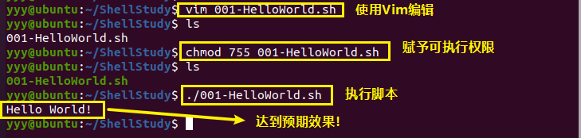

#### 方式二：sh+脚本（不推荐）
* 方法：不用赋予脚本可执行权限，直接执行即可
* 举例

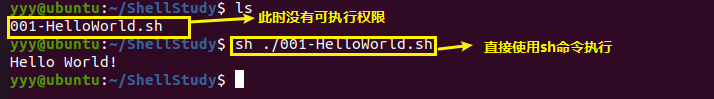


## 03.Shell注释

* Shell中的注释分两种
  * 单行注释：类似Python语法，用`#`打头即可
  * 多行注释：略显诡异，用`:<<!`开头，用`!`结尾，中间为注释
* 举例

```sh
#! /bin/bash

echo "Hello, World!"  # 这是一个单行注释

:<<!
这是一个多行注释
上面的语句打印了“Hello，World！”
这个注释看起来怪怪的……
!
```


## 04.Shell变量

### 4.1 Shell变量介绍

* 变量分类
  * 系统变量
    * 环境变量：`$HOME`、`$PWD`、`$SHELL`、`$USER`等
    * 预定义变量：`$$`、`$!`、`$?`
  * 用户自定义变量
    * `$TOMCAT_HOME`
* 如何显示当前Shell的所有变量？
  * `$ set`命令

* 举例
  * 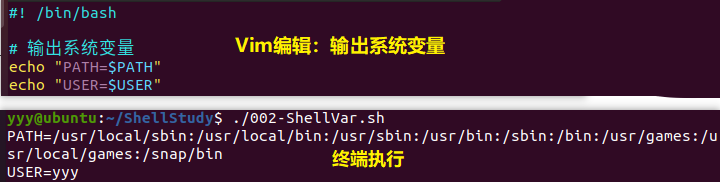


### 4.2 Shell变量定义

#### 4.2.0 概念

* 脚本语言在定义变量时通常不需要指明类型，**直接赋值**就可以，Shell 变量也遵循这个规则。
* 在 Bash shell 中，每一个变量的值**都是字符串**，无论你给变量赋值时有没有使用引号，值都会以字符串的形式存储。
* 当然，如果有必要，你也可以使用 [Shell declare](http://c.biancheng.net/view/2709.html) 关键字显式定义变量的类型，但在一般情况下没有这个需求，Shell 开发者在编写代码时自行注意值的类型即可。

#### 4.2.1 基本语法

**（1）定义变量**

```shell
var=value
var='value'
var="value"
```

* variable 是变量名，value 是赋给变量的值。
  * 如果 value 不包含任何空白符（例如空格、Tab 缩进等），那么可以不使用引号；
  * 如果 value 包含了空白符，那么就必须使用引号包围起来。
  * 使用单引号和使用双引号也是有区别的，稍后我们会详细说明。
* Shell中定义变量一般遵循以下规则
  * 变量名称可以由字母、数字和下划线组成，但是不能以数字开头。
  * 变量名称一般习惯为**大写**
  * ***赋值号两侧不能有空格！！！***（这一点需要特别注意！！！）

**（2）使用变量**

* 使用一个定义过的变量，只要在变量名前面加美元符号`$`即可，如：

```shell
animal="sheep"
echo $animal
echo ${animal}
```

* 变量名外面的花括号`{ }`是可选的，加不加都行，加花括号是为了帮助解释器识别变量的边界，比如下面这种情况：

```shell
skill="Java"
echo "I am good at ${skill}Script."
```

* 如果不给 skill 变量加花括号，写成`echo "I am good at $skillScript"`，解释器就会把 $skillScript 当成一个变量（其值为空），代码执行结果就不是我们期望的样子了。
* 其实，`${var}`比起`$var`还有一个优势，就是当`var`是字符串时`${var}`可以保留原格式，具体的例子请见4.2.3。

* **推荐给所有变量加上花括号`{}`，这是一个良好的编程习惯。**

**（3）单引号和双引号的区别**

```shell
#!/bin/bash
url="http://c.biancheng.net"
website1='C语言中文网：${url}'
website2="C语言中文网：${url}"
echo $website1
echo $website2
```


* 从上图很容易就可以看出区别了
  * 以单引号`''`括住变量时，会将里面的内容原封不动的输出，即使有变量和命令（命令需要反引起来）
  * 以双引号`""`括住变量时，输出时会先解析里面的命令和变量。

**（4）只读变量**

* 使用`readonly`可以定义只读变量，它的值不能被改变，也不能被删除（下面马上讲到变量的删除）。

	```shell
  #!/bin/bash

  animal="sheep"
  readonly animal  # 将变量声明为只读变量
  animal="dog"  # 再次尝试修改，此时会报错
	```

**（5）删除变量**

* 使用`unset`命令可以删除变量。语法如下

  ```shell
  unset var_name
  ```

* 说明两点

  * 变量被删除后不能再次引用（若引用并不会报错，知识内容为空）
  * `unset`命令不能删除只读变量

#### 4.2.2 快速入门案例

* 案例：
  * 定义变量A，打印输出，然后将其撤销，再次打印输出
  * 定义静态变量B，打印输出，然后尝试将其撤销，再次打印输出
* 代码


```shell
#==========002-ShellVar.sh============
#! bin/bash
A=100  # 定义变量A并赋值，注意“等号两端不能有空格！”
echo "A=$A"
unset A  # 撤销变量A
echo "A=$A"  # 此时输出$A为空

readonly B=200  # 定义B为静态变量并赋值
echo "B=$B"
unset B  # 尝试撤销静态变量，必失败！
echo "B=$B"
```

* 效果

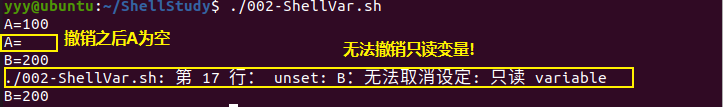


#### 4.2.3 用变量捕获命令返回值（重要）

**（1）语法**

```shell
A=`ls -al`  # 方法一：使用反引号赋值
A=$(ls -al)  # 方法二：使用$()赋值，与反引号效果等价
```

**（2）代码**

```shell
#=============002-ShellVar.sh==========
#! /bin/bash

RESULT=`ls -alh | tail -3`  # 使用方法一
echo $RESULT
echo "================================================"
MY_DATE=$(date)  # 使用方法二
echo "date=$MY_DATE"
```

**（3）效果**

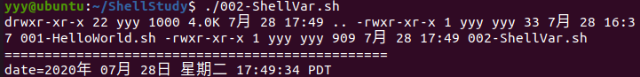

**（4）问题**

* 有没有发现`ls -alh | tail -3`的输出结果很乱呢？换行符竟然丢失了！

**（5）改进**

```shell
# 将命令返回值赋值给变量
RESULT=`ls -alh / | tail -3`
echo "==================换行符丢失======================="
echo $RESULT  # 如此打印，换行会被替换成空格
echo "==================保留原格式======================="
echo "${RESULT}"  # 保留原格式
echo "===================打印日期========================"
MY_DATE=$(date)
echo "date=$MY_DATE"
```

**（6）改进后效果**

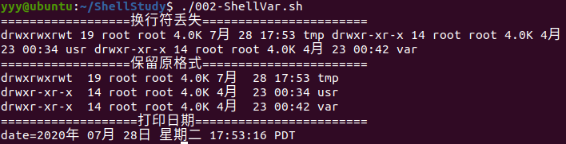

* 上面的改进过程说明了一个问题，`${VAR}`要比`$VAR`要好一些。毕竟对于字符串前者可以保持原格式。养成好习惯哦~

#### 4.2.4 数组变量

**(0)说明**

和其他编程语言一样，Shell 也支持数组。数组（Array）是若干数据的集合，其中的每一份数据都称为元素（Element）。

获取数组中的元素要使用下标`[ ]`，下标可以是一个整数，也可以是一个结果为整数的表达式；当然，下标必须大于等于 0。

遗憾的是，常用的 Bash Shell 只支持一维数组，不支持多维数组。

**(1)定义**

```shell
array_name=(ele1 ele2 ele3 ... elen)
```

* 在 Shell 中，用括号`( )`来表示数组，数组元素之间用空格来分隔。

* 注意，**赋值号`=`两边不能有空格**，必须紧挨着数组名和数组元素。

* Shell是弱类型的，它并不要求所有数组元素的类型必须相同，例如：

  ```shell
  arr=(18 99 "yyy")
  ```

* Shell数组的长度不是固定的，可以随时添加，例如：

  ```shell
  nums=(23 45 67 21 99 89)  # 这里定义了6个元素
  
  nums[6]=1000  # 再来添加第7个元素（注意下标是从0开始的）
  ```

* 此外，你无需逐个元素地给数组赋值，下面的代码就是只给特定元素赋值

  ```shell
  nums=([3]=24 [7]=99 [10]=100)
  ```

  * 上述代码只给第3、7、10个元素赋值，所以数组长度是3

**(2)使用**

获取数组元素的值，一般使用下面的格式：

```shell
${array_name[index]}
```

使用`*`或`@`可以获取数组中的所有元素，例如：

```shell
${nums[*]}
${nums[@]}
```

**(3)获取数组长度**

利用`@`或`*`，可以将数组扩展成列表，然后使用`#`来获取数组元素的个数，格式如下：

```shell
${#array_name[@]}
${#array_name[*]}
```

如果某个元素是字符串，还可以通过指定下标的方式获取该元素的长度：

```shell
${#array_name[2]}  # 假设2号元素是字符串
${#"test_string"}  # 对于普通的字符串变量，也可以用此方法
```

==TODO==: 数组的拼接、关联数组等

**(4)示例：数组的定义与使用**

```shell
#!/bin/bash

array=(34 92 4 56 "杨阳羊")
echo "【输出所有元素】            ${array[@]}"
array[10]="嘿嘿嘿"  # 给第10个元素赋值（此时会增加数组的长度）
echo "================已添加第10号元素=================="
echo "【再次输出所有元素】        ${array[*]}" 

echo "【输出单个元素】            ${array[10]}"
echo "【输出字符串元素长度】      len(嘿嘿嘿)=${#array[10]}"
echo "【尝试输出一个不存在的元素】array[7]=${array[7]}"  #输出一个不存在的元素
```

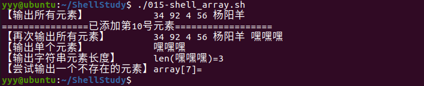


### 4.3 位置参数变量

#### 4.3.1 介绍

当我们执行一个shell 脚本时，如果希望获取到命令行的参数信息，就可以使用到位置参数变量，比如： `./myshell.sh 100 200`, 这个就是一个执行shell 的命令行，可以在myshell 脚本中获取到参数信息

#### 4.3.2 基本语法

| 变量符号 | 含义                                                         |
| -------- | ------------------------------------------------------------ |
| `$n`     | n 为数字，`$0` 代表命令本身，`$1`-`$9` 代表第一到第九个参数，十以上的参数需要用大括号包含，如`${10}` |
| `$*`     | 这个变量代表命令行中所有的参数，`$*`把所有的参数看成**一个整体** |
| `$@`     | 这个变量也代表命令行中所有的参数，不过`$@`把每个参数**区分对待** |
| `$#`     | 这个变量代表命令行中所有参数的**个数**                       |

#### 4.3.3 上手小案例

案例：编写一个shell 脚本positionPara.sh ， 在脚本中获取到命令行的各个参数信息。

```shell
# =============003-PositionPara.sh==============
#! /bin/bash

echo "\$0: $0"
echo "\$1: $1"
echo "\$2: $2"
echo "所有参数(\$*): $*"
echo "所有参数(\$@): $@"
echo "参数个数: $#"

```

执行效果如下：
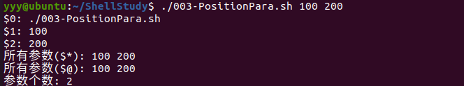


### 4.4 预定义变量

#### 4.4.1 概念

预定义变量是在 Shell 一开始时就定义的变量，这一点和默认环境变量有些类似。不同的是，预定义变量不能重新定义，用户只能根据 Shell 的定义来使用这些变量。

那么，预定义变量有哪些呢？请看下表~

| 预定义变量 | 说明                                                         |
| ---------- | ------------------------------------------------------------ |
| `$?`       | 最后一次执行的命令的返回状态。如果这个变量的值为 0，则证明上一条命令正确执行；如果这 个变量的值为非 0 (具体是哪个数由命令自己来决定)，则证明上一条命令执行错误 |
| `$$`       | 当前进程的进程号（PID)                                       |
| `$!`       | 后台运行的最后一个进程的进程号（PID)                         |

#### 4.4.2 示例

* `$?`示例

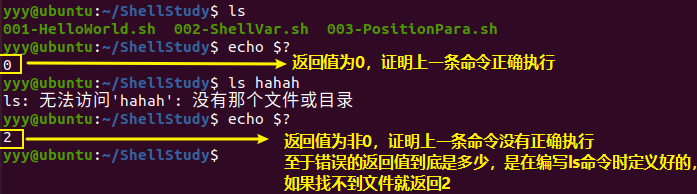

* `$!`示例

```shell
# ==============PredefdVar.sh===============
#!/bin/bash
echo "当前进程PID： $$"
#输出当前进程的PID
#这个PID就是variable.sh脚本执行时生成的进程的PID
find ./ -name 001-HelloWorld.sh &
#使用find命令在当前目录下找到001-HelloWorld.sh文件
#符号"&"的意思是把命令放入后台执行
echo "后台最后一个进程PID： $!"
#输出这个后台执行命令的进程的PID,也就是输出find命令的PID
```


* `$$`示例1——检测是否开了新进程

首先编写如下脚本文件，并命名为check_PID.sh

```shell
#!/bin/bash
echo "新进程ID：$$"  # 输出当前进程的PID
```

然后再Shell中执行脚本，效果图如下：

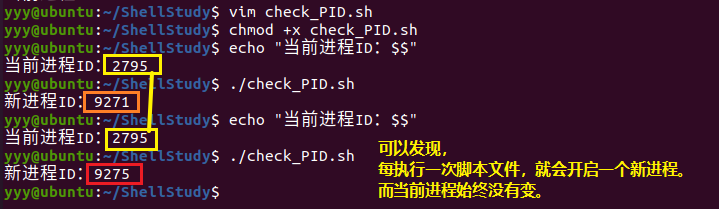

* `$$`示例2——在当前进程中运行Shell脚本

在当前进程中运行Shell脚本其实非常简单，只需加一个`.`号便可，废话少说，直接看图~

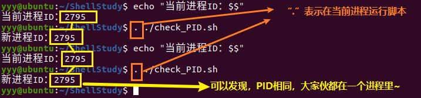


### 4.5 变量作用域（重要）

说明：如果你是Shell编程新手，那么该部分要等学完“函数“部分才能看懂。该笔记作为一份总结性笔记，为保持知识点的连贯性，故将其放在了这里。

#### 4.5.0 Shell变量作用域分类

Shell 变量的作用域可以分为三种：

* **局部变量**(local variable)：只能在函数内部使用
* **全局变量**(global variable)：可以在当前Shell进程中使用
* **环境变量**(environment variable)：还可以在子进程中使用

#### 4.5.1 Shell局部变量

Shell 也支持自定义函数（关于函数，在后面会有讲解，建议看完函数再回过头来看这一部分内容，这样阅读起来会轻松许多），但是 Shell 函数和 C++、Java、C# 等其他编程语言函数的一个不同点就是：在 Shell 函数中定义的变量默认也是全局变量，它和在函数外部定义变量拥有一样的效果。请看下面的代码：

```shell
#! /bin/bash

# 定义函数
function func(){
	a=99
}

# 调用函数
func

# 输出函数内部的变量
echo $a  # 输出结果：99
```

a 是在函数内部定义的，但是在函数外部也可以得到它的值，证明它的作用域是**全局**的，而不是仅限于函数内部。

要想变量的作用域仅限于函数内部，可以在定义时加上`local`关键字，此时该变量就成了局部变量。请看下面的代码：

```shell
#!/bin/bash
#定义函数
function func(){
    local a=99
}

#调用函数
func

#输出函数内部的变量
echo $a  # 此时输出结果为空，表明便令a在函数外部无效，是一个局部变量。
```

Shell 变量的这个特性和 JavaScript 中的变量是类似的。**在 JavaScript 函数内部定义的变量，默认也是全局变量**，只有加上`var`关键字，它才会变成局部变量。

#### 4.5.2 Shell全局变量

所谓全局变量，就是指变量在当前的整个 Shell **进程**中都有效。每个 Shell 进程都有自己的作用域，彼此之间互不影响。**在 Shell 中定义的变量，默认就是全局变量**。

例如，现在有两个 Shell 脚本文件，分别是 a.sh 和 b.sh。

a.sh 的代码如下：

```shell
#!/bin/bash
echo $a
b=200
```

b.sh 的代码如下：

```shell
#!/bin/bash
echo $b
```

打开一个Shell窗口，同一进程中执行脚本（上文4.4.2节最后一个例子给出了如何在统一进程中执行脚本），效果如下：

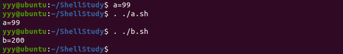

这三条命令都是在一个进程中执行的，从输出结果可以发现，在 Shell 窗口中以命令行的形式定义的变量 a，在 a.sh 中有效；在 a.sh 中定义的变量 b，在 b.sh 中也有效，变量 b 的作用范围已经超越了 a.sh。

#### 4.5.3 Shell环境变量

全局变量只在当前 Shell 进程中有效，对其它 Shell 进程和子进程都无效。如果使用`export`命令将全局变量导出，那么它就在所有的子进程中也有效了，这称为“环境变量”。

环境变量被创建时所处的 Shell 进程称为父进程，如果在父进程中再创建一个新的进程来执行 Shell 命令，那么这个新的进程被称作 Shell 子进程。当 Shell 子进程产生时，它会继承父进程的环境变量为自己所用，所以说环境变量可从父进程传给子进程。不难理解，环境变量还可以传递给孙进程。

注意，两个没有父子关系的 Shell 进程是不能传递环境变量的，并且环境变量只能向下传递而不能向上传递，即“传子不传父”。

创建 Shell 子进程最简单的方式是运行 bash 命令，如下图所示。

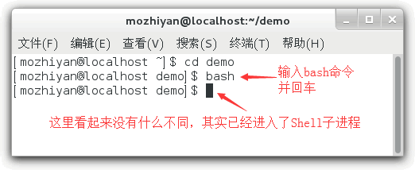

通过`exit`命令可以一层一层地退出 Shell。

下面演示一下环境变量的使用：

```bash
[yyy@ubuntu]$ a=22       #定义一个全局变量
[yyy@ubuntu]$ echo $a    #在当前Shell中输出a，成功
22
[yyy@ubuntu]$ bash       #进入Shell子进程
[yyy@ubuntu]$ echo $a    #在子进程中输出a，失败

[yyy@ubuntu]$ exit       #退出Shell子进程，返回上一级Shell
exit
[yyy@ubuntu]$ export a   #将a导出为环境变量
[yyy@ubuntu]$ bash       #重新进入Shell子进程
[yyy@ubuntu]$ echo $a    #在子进程中再次输出a，成功
22
[yyy@ubuntu]$ exit       #退出Shell子进程
exit
[yyy@ubuntu]$ exit       #退出父进程，结束整个Shell会话
```

可以发现，默认情况下，a 在 Shell 子进程中是无效的；使用 export 将 a 导出为环境变量后，在子进程中就可以使用了。

`export a`这种形式是在定义变量 a 以后再将它导出为环境变量，如果想在定义的同时导出为环境变量，可以写作`export a=22`。

我们一直强调的是环境变量在 Shell 子进程中有效，并没有说它在所有的 Shell 进程中都有效；如果你通过终端创建了一个新的 Shell 窗口，那它就不是当前 Shell 的子进程，环境变量对这个新的 Shell 进程仍然是无效的。请看下图：


第一个窗口中的环境变量 a 在第二个窗口中就无效。

**环境变量也是临时的**

通过 export 导出的环境变量只对当前 Shell 进程以及所有的子进程有效，如果最顶层的父进程被关闭了，那么环境变量也就随之消失了，其它的进程也就无法使用了，所以说环境变量也是临时的。

有读者可能会问，如果我想让一个变量在所有 Shell 进程中都有效，不管它们之间是否存在父子关系，该怎么办呢？

只有将变量写入 **Shell 配置文件**中才能达到这个目的！Shell 进程每次启动时都会执行配置文件中的代码做一些初始化工作，如果将变量放在配置文件中，那么每次启动进程都会定义这个变量。那么如何配置全局性的环境变量呢？请看下一小节~

#### 4.5.4 设置环境变量

【第一步】在Shell配置文件（`/etc/profile`）中，使用`export`语句配置新的环境变量

```shell
# 在/etc/profile末尾，添加下面一句
export 变量名=变量值  # 第一步：将shell 变量输出为环境变量
```

【第二步】在命令行中，使用`source`命令使刚刚的配置立即生效

```bash
source /etc/profile  # 第二步：让修改后的配置信息立即生效
```

【第三步】在命令行中，使用`echo`检测是否可以使用

```bash
echo $变量名
```


## 05.Shell数学计算

### 5.1 运算符

| 算术运算符            | 说明/含义                                                |
| --------------------- | -------------------------------------------------------- |
| +、-                  | 加法（或正号）、减法（或负号）                           |
| *、/、%               | 乘法、除法、取余（取模）                                 |
| **                    | 幂运算                                                   |
| ++、--                | 自增和自减，可以放在变量的前面也可以放在变量的后面       |
| !、&&、\|\|           | 逻辑非（取反）、逻辑与（and）、逻辑或（or）              |
| <、<=、>、>=          | 比较符号（小于、小于等于、大于、大于等于）               |
| ==、!=、=             | 比较符号（相等、不相等；对于字符串，= 也可以表示相当于） |
| <<、>>                | 向左移位、向右移位                                       |
| ~、\|、 &、^          | 按位取反、按位或、按位与、按位异或                       |
| =、+=、-=、*=、/=、%= | 赋值运算符，例如 a+=1 相当于 a=a+1，a-=1 相当于 a=a-1    |

### 5.2 Shell数学计算窘况

但是，Shell 和其它编程语言不同，Shell 不能直接进行算数运算，必须使用数学计算命令，这让初学者感觉很困惑，也让有经验的程序员感觉很奇葩。

下面我们先来看一个反面的例子：

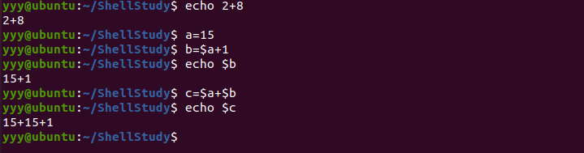

从上面的运算结果可以看出，默认情况下，Shell 不会直接进行算术运算，而是把`+`两边的数据（数值或者变量）当做**字符串**，把`+`当做**字符串连接符**，最终的结果是把两个字符串拼接在一起形成一个新的字符串。

这是因为，在 Bash Shell 中，如果不特别指明，**每一个变量的值都是字符串**，无论你给变量赋值时有没有使用引号，值都会以字符串的形式存储。

换句话说，Bash shell 在默认情况下不会区分变量类型，即使你将整数和小数赋值给变量，它们也会被视为字符串，这一点和大部分的编程语言不同。

### 5.3 数学计算命令

要想让数学计算发挥作用，必须使用数学计算命令，Shell 中常用的数学计算命令如下表所示。

| 运算操作符/运算命令 | 说明                                                         |
| ------------------- | ------------------------------------------------------------ |
| (())                | 用于整数运算，效率很高，**推荐使用**。                       |
| let                 | 用于整数运算，和 (()) 类似。                                 |
| $[]                 | 用于整数运算，不如 (()) 灵活。                               |
| expr                | 可用于整数运算，也可以处理字符串。比较麻烦，需要注意各种细节，不推荐使用。 |
| bc                  | Linux下的一个计算器程序，可以处理整数和小数。Shell 本身只支持整数运算，想计算小数就得使用 bc 这个外部的计算器。 |
| declare -i          | 将变量定义为整数，然后再进行数学运算时就不会被当做字符串了。功能有限，仅支持最基本的数学运算（加减乘除和取余），不支持逻辑运算、自增自减等，所以在实际开发中很少使用。 |

> 如果大家时间有限，只学习 (()) 和 bc 即可，不用学习其它的了。
>
> (()) 可以用于整数计算，bc 可以小数计算。

### 5.4 Shell(())的用法

#### 5.4.1 Shell(())基础语法

双小括号 (( )) 是 Bash Shell 中专门用来进行整数运算的命令，它的**效率很高，写法灵活**，是**企业运维**中常用的运算命令。

注意：(( )) **只能进行整数运算**，不能对小数（浮点数）或者字符串进行运算。后续讲到的 **bc 命令**可以用于小数运算。

双小括号 (( )) 的语法格式为：

```shell
((表达式))
```

通俗地讲，就是将数学运算表达式放在`((`和`))`之间。

表达式可以只有一个，也可以有多个，多个表达式之间以逗号`,`分隔。对于多个表达式的情况，以**最后一个表达式的值**作为整个 (( )) 命令的执行结果。

可以使用`$`获取 (( )) 命令的结果，这和使用`$`获得变量值是类似的。

| 运算操作符/运算命令                                 | 说明                                                         |
| --------------------------------------------------- | ------------------------------------------------------------ |
| ((a=10+66) ((b=a-15)) ((c=a+b))                     | 这种写法可以在计算完成后给变量赋值。以 ((b=a-15)) 为例，即将 a-15 的运算结果赋值给变量 b。  注意，使用变量时不用加`$`前缀，(( )) 会自动解析变量名。 |
| `a=$((10+66))`<br />`b=$((a-15))`<br />`c=$((a+b))` | 可以在 (( )) 前面加上`$`符号获取 (( )) 命令的执行结果，也即获取整个表达式的值。以 `c=$((a+b))` 为例，即将 a+b 这个表达式的运算结果赋值给变量 c。  注意，类似 c=((a+b)) 这样的写法是错误的，不加`$`就不能取得表达式的结果。 |
| ((a>7 && b==c))                                     | (( )) 也可以进行逻辑运算，在 if 语句中常会使用逻辑运算。     |
| echo $((a+10))                                      | 需要立即输出表达式的运算结果时，可以在 (( )) 前面加`$`符号。 |
| ((a=3+5, b=a+10))                                   | 对多个表达式同时进行计算。                                   |

* 在 (( )) 中使用变量无需加上`$`前缀，**(( )) 会自动解析变量名**，这使得代码更加简洁，也符合程序员的书写习惯。

#### 5.4.2 Shell(())示例

```bash
# ==================示例一：简单数值计算=====================
[yyy@ubuntu]$ echo $((1+1))
2
[yyy@ubuntu]$ echo $((6-3))
3
[yyy@ubuntu]$ i=5
[yyy@ubuntu]$ ((i=i*2))  #可以简写为 ((i*=2))。
[yyy@ubuntu]$ echo $i   #使用 echo 输出变量结果时要加 $。
10

# ==================示例二：复杂数值计算=====================
[yyy@ubuntu]$ ((a=1+2**3-4%3))
[yyy@ubuntu]$ echo $a
8
[yyy@ubuntu]$ b=$((1+2**3-4%3)) #运算后将结果赋值给变量，变量放在了括号的外面。
[yyy@ubuntu]$ echo $b
8
[yyy@ubuntu]$ echo $((1+2**3-4%3)) #也可以直接将表达式的结果输出，注意不要丢掉 $ 符号。
8
[yyy@ubuntu]$ a=$((100*(100+1)/2)) #利用公式计算1+2+3+...+100的和。
[yyy@ubuntu]$ echo $a
5050
[yyy@ubuntu]$ echo $((100*(100+1)/2)) #也可以直接输出表达式的结果。
5050
# ==================示例三：逻辑运算=====================
[yyy@ubuntu]$ echo $((3<8))  #3<8 的结果是成立的，因此，输出了 1，1 表示真
1
[yyy@ubuntu]$ echo $((8<3))  #8<3 的结果是不成立的，因此，输出了 0，0 表示假。
0
[yyy@ubuntu]$ echo $((8==8)) #判断是否相等。
1
[yyy@ubuntu]$ if ((8>7&&5==5))
> then
> echo yes
> fi
yes
# ==================示例四：同时对多个表达式计算==================
[yyy@ubuntu]$ ((a=3+5, b=a+10))  #先计算第一个表达式，再计算第二个表达式
[yyy@ubuntu]$ echo $a $b
8 18
[yyy@ubuntu]$ c=$((4+8, a+b))  #以最后一个表达式的结果作为整个(())命令的执行结果
[yyy@ubuntu]$ echo $c
26
# ==================示例二：自增自减=====================
[yyy@ubuntu]$ a=10
[yyy@ubuntu]$ echo $((a++))  #如果++在a的后面，那么在输出整个表达式时，会输出a的值,因为a为10，所以表达式的值为10。
10
[yyy@ubuntu]$ echo $a #执行上面的表达式后，因为有a++，因此a会自增1，因此输出a的值为11。
11
[yyy@ubuntu]$ a=11
[yyy@ubuntu]$ echo $((a--)) #如果--在a的后面，那么在输出整个表达式时，会输出a的值，因为a为11，所以表达式的值的为11。

```

### 5.5 bc命令

该部分内容较多，请参考[Linux bc命令：一款数学计算器](http://c.biancheng.net/view/vip_3237.html)

## 06.条件判断（重要！）

### 6.1 基本语法

```shell
[ condition ]
```

* 注意！**condition前后要有空格！！！！！**
* 非空返回true，可使用`$?`验证（`$?`返回值：0为true，>1为false）

### 6.2 举例

* 以下返回值结果均是在执行脚本文件后使用`echo $?`验证。

```shell
[ yyy ]  # 返回true

[ ]  # 返回false。注意：中间有个空格，否则会报错！

[ 0 ]  # 这个竟然返回true！这一点与C不同~

[ condition ] && echo OK || echo NotOK  # 条件满足，打印OK；否则打印NotOK
```

### 6.3 常用判断条件

#### 6.3.1 字符串比较

* 条件

| 条件                  | 说明                                        |
| --------------------- | ------------------------------------------- |
| [ str1 == str2 ]      | 判断两字符串是否相等，相等为true。          |
| [ str1 != str2 ]      | 判断两字符串是否不等，不等为true。          |
| [ -n str ] 或 [ str ] | 判断字符串是否为非空，非空为true，空为false |
| [ -z str ]            | 判断字符串是否为空，空为true，非空为false   |

* 案例
```shell
#! /bin/bash

STR1="yyy k"
STR2="yyy k"
STR3="YYY K"

# ============错误版本1==================
[ $STR1==$STR2 ] && echo "$STR1=$STR2" || echo "$STR1!=$STR2"
[ $STR2==$STR3 ] && echo "$STR2=$STR3" || echo "$STR2!=$STR3"
# 【错误分析】比较运算符两侧没有空格，错误！为啥比较运算符两侧还需要空格呢？你想想啊，用到中括号的地方太多了：通配符、正则表达式……这里条件比较又要用到，当然要有些不同！

#=============错误版本2==================
[ $STR1 == $STR2 ] && echo "$STR1=$STR2" || echo "$STR1!=$STR2"
[ $STR2 == $STR3 ] && echo "$STR2=$STR3" || echo "$STR2!=$STR3"
# 【错误分析】变量没有用双引号括起来！这与具体比较内容有关，上面的字符串中含有一个空格，会报错，如果不含空格，则上面的写法可以正确运行。
#如果不用双引号引起来，bash会报这样的错误："too many arguments"，为啥呢？因为如果不引起来，上面的判定式会变成下面这样子：“yyy k == YYY K”，左右两边各有两个参数！当然不对啦！

# ==============正确版本===================
[ "$STR1" == "$STR2" ] && echo "$STR1=$STR2" || echo "$STR1!=$STR2"
[ "$STR2" == "$STR3" ] && echo "$STR2=$STR3" || echo "$STR2!=$STR3"

# ==============正确版本（规范）================
[ "${STR1}" == "${STR2}" ] && echo "${STR1}=${STR2}" || echo "${STR1}!=${STR2}"
[ "${STR2}" == "${STR3}" ] && echo "${STR2}=${STR3}" || echo "${STR2}!=${STR3}"        
```

* 根据上述例子可以总结出以下几点特别需要注意的地方
  * 在中括号内的**每个组件都需要有空格来分隔**
  * 在中括号内的**字符串变量或常量**，最好都以**双引号**括起来
  * 对于字符串变量的引用，最好用`${STR}`而非`$STR`

#### 6.3.2 整数比较

* 条件

| 条件          | 说明                                              |
| ------------- | ------------------------------------------------- |
| [ n1 -eq n2 ] | 判断两个数n1与n2是否相等，相等为true，不等为false |
| [ n1 -ne n2]  | 判断两个数n1与n2是否不等，不等为true，相等为false |
| [ n1 -gt n2 ] | n1是否大于n2（greater than）                      |
| [ n1 -lt n2 ] | n1是否小于n2（less than）                         |
| [ n1 -ge n2 ] | n1是否大于等于n2（greater than or equal）         |
| [ n1 -le n2 ] | n1是否小于等于n2（less than or equal）            |


#### 6.3.3 判断文件权限

* 条件

| 条件 | 说明                                 |
| ---- | ------------------------------------ |
| -r   | 文件是否存在且具有【可读】权限       |
| -w   | 文件是否存在且具有【可写】权限       |
| -x   | 文件是否存在且具有【可执行】权限     |
| -u   | 文件是否存在且具有【SUID】属性       |
| -g   | 文件是否存在且具有【SGID】属性       |
| -k   | 文件是否存在且具有【Sticky bit】属性 |
| -s   | 文件是否存在且为【非空文件】         |

#### 6.3.4 判断文件类型

* 条件

| 条件 | 说明                                        |
| ---- | ------------------------------------------- |
| -e   | 文件名是否存在（常用）                      |
| -f   | 文件名是否存在且为文件(file)（常用）        |
| -d   | 文件名是否存在且为目录(directory)（常用）   |
| -b   | 文件名是否存在且为一个 block device 设备    |
| -c   | 文件名是否存在且为一个 character device设备 |
| -S   | 文件名是否存在且为一个socket文件            |
| -p   | 文件名是否存在且为一个FIFO（pipe）文件      |
| -L   | 文件名是否存在且为一个链接文件              |


* 案例：编写Shell脚本，在`/tmp/yyy`下新建`/tmp/yyy/kkk.txt`，首先判断`/tmp/yyy`是否存在，如果不存在，新建该目录，如果存在，则直接建立文件。要求用一条语句完成。

```shell
[ -e /tmp/yyy ] || mkdir tmp/yyy && touch /tmp/yyy/kkk.txt
```

* （==TODO==: 详细解释见《鸟哥的Linux私房菜》P349。）

#### 6.3.5 文件比较

| 条件                | 说明                                                      |
| ------------------- | --------------------------------------------------------- |
| [ file1 -nt file2 ] | (newer than)判断file1是否比file2新                        |
| [ file2 -ot file2 ] | （older than）判断file1是否比file2旧                      |
| [ file1 -ef file2 ] | 判断file1与file2是否为同一个文件，可用在判断hard link上。 |

#### 6.3.6 多重条件判定(重要)

| 条件                         | 说明                         |
| ---------------------------- | ---------------------------- |
| [ condition1 -a condition2 ] | (and)判断两条件是否同时成立  |
| [ condition1 -o condition2 ] | (or)判断两条件是否有一个成立 |
| [ ! condition ]              | 判断condition是否不成立      |


## 07.流程控制（重要）

### 7.1 `if`判断

* 语法

```shell
# 【格式一】
if [ condition ]; then
	(程序)...
elif [ condition ]; then
	(程序)...
else
	(程序)...
fi  # if倒着写，表示结束


# 【格式二】
if [ condition ]
	then
		(程序)...
elif [ condition ]
	then
		(程序)...
else
    (程序)...
fi
```
* 案例：从位置参数变量中获取两个数，判断两个数的大小关系。

```shell
#! /bin/bash

if [ "$1" -gt "$2" ]; then 
	echo "$1>$2"
elif [ "$1" -lt "$2" ]; then
	echo "$1<$2"
else 
	echo "$1=$2"
fi 
```

### 7.2 `case`语句

* 基本语法

```shell
case ${变量名} in   # 关键字为case，后面还有个in
	"值1")         # 每个变量值建议用双引号引起来，右侧还有个右圆括号
		程序段1...
		;;		   # 每个小分支结尾使用两个连续的分号
	"值2")
		程序段2...
		;;
	# ...其他分支省略...
	*)
		如果变量值在上面没有，就执行此程序
		;;
esac  			   # case倒着写，表示结束
		
```

* 案例：【性别判断】当命令行参数是`0`时，输出“woman”，是`1`时，输出“man”，其他情况输出“ohter”

```shell
#! /bin/bash

case $1 in
	"0")
		echo "woman"
		;;
	"1")
		echo "man"
		;;
	*)
		echo "other"
		;;
esac
```


### 7.3 `for`循环

#### 7.3.1 语法一

* 语法（该语法类似于Python的for循环）

```shell
for var in val1 val2 val3 ...
do
	程序段
done
```

* 说明
  * 第一次循环时，`$var`的内容为`val1`
  * 第二次循环时，`$var`的内容为`val2`
  * 第三次循环时，`$var`的内容为`val3`
  * ……
* 案例：打印命令行输入的参数

```shell
#! /bin/bash

echo "=============[\$*]================"
for i in "$*"
do
        echo "the value is $i."
done

echo "=============[\$@]================"

for j in "$@"
do
        echo "the value is $j."
done
```

* 测试效果
  * 从下面的结果可以看出：
    * `$*`是将各参数看成一个整体
    * 而`$@`则将各参数分开来看

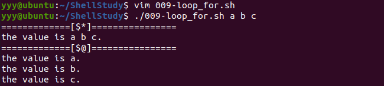

#### 7.3.2 语法二

* 语法（该语法类似于C的for循环）

```shell
for ((初始值;循环控制条件;变量变化))
do
	程序段
done
```

* 案例：求1加到100的和。

```shell
#! /bin/bash

SUM=0
for((i=1;i<=100;i++))  # for循环括号内部的运算符使用规则完全同C语言，简单！
do
        SUM=$[${SUM}+${i}]  # for循环括号外部的运算符则要按照前面介绍的规则老老实实写……
done
echo "1+2+...+100=${SUM}"
```

### 7.4 `whlie`循环

* 基本语法

```shell
while [ 条件判断式 ]
do
	程序段
done
```

* 案例：从命令行输入一个整数n，计算1+2+...+n的值

```shell
#! /bin/bash

i=$1
SUM=0
while [ $i -ne "0" ]
do
        SUM=$[$SUM+$i]
        i=$[$i-1]
done

echo "1+2+...+$1=$SUM"
```


## 08.`read`读取控制台输入

### 8.1 基本语法

* 基本语法

```shell
read [options] [变量名]
```

* 选项列表

| 选项 | 含义                                                         |
| ---- | ------------------------------------------------------------ |
| -p   | (promotion)指定读取值时的提示符                              |
| -t   | 指定读取值时等待的时间（秒），如果没有在指定时间内输入就不再等待了 |


### 8.2 应用实例

### 8.2.1 案例一

* 要求：读取控制台输入的一个整数值并打印出来

```shell
#! /bin/bash

read -p "请输入一个整数：" NUM
echo "您输入的整数是[$NUM]"
```

### 8.2.2 案例二

```shell
#! /bin/bash

read -t 10 -p "请在10内输入一个整数：" NUM
echo "您输入的整数是[$NUM]"
```


## 09.Shell函数

### 9.0 函数介绍

* 像其他编程语言一样，Shell语言也有函数，主要分为两大类：
  * 系统函数
  * 自定义函数

### 9.1 系统函数举例

#### 9.1.1 `basename`函数

* 功能：返回完整路径的最后一部分，用于获取文件名
* 格式：`basename [pathname] [suffix]`
  * `basename`命令会删掉所有的前缀，包括最后一个`/`字符，然后将字符串显示出来
  * `suffix`为后缀，如果它被指定，`basename`将会把`pathname`中的`suffix`去掉
* 举例：

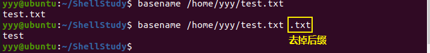

#### 9.1.2 `dirname`函数

* 功能：与`basename`相对，`dirname`返回完整路径最后的`/`的前面的部分，常用于返回路径部分。
* 格式：`dirname [pathname]`
* 举例：


### 9.2 自定义函数

#### 9.2.1 基本语法

**（1）Shell函数定义**

```shell
function funcname(){
	statements
	[return value]
}
```

* `function`是Shell中的关键字，专门用来定义函数
* `funcname`是函数名
* `statements`是函数要执行的代码，也就是一组语句
* `return value`表示函数的返回值，其中 return 是 Shell 关键字，专门用在函数中返回一个值；这一部分可以写也可以不写。

**（2）Shell函数调用**

```shell
funcname [param1 param2 ...]
```

* 和其它编程语言不同的是，Shell 函数在定义时不能指明参数，但是在调用时却可以传递参数，并且给它传递什么参数它就接收什么参数。
* Shell 也不限制定义和调用的顺序，你可以将定义放在调用的前面，也可以反过来，将定义放在调用的后面。

#### 9.2.2 函数参数

函数参数是Shell位置参数的一种，如下

| 参数 | 说明                                               |
| ---- | -------------------------------------------------- |
| `$n` | `$1` 表示第一个参数，`$2` 表示第二个参数，依次类推 |
| `$#` | 可以获取传递的参数的个数                           |
| `$@` | 一次性获取所有参数，区别对待各参数                 |
| `$*` | 一次性获取所有参数，将其看做一个整体               |


#### 9.2.3 应用实例

* 案例：编写一个函数，计算所有参数的和

* 代码实现

  ```shell
  #!/bin/bash
  function getSum(){
  	local sum=0
  	for i in $@
  	do
  		((sum+=i))
  	done
  	echo "sum=$sum"
  	return 0
  }
  
  getSum 1 2 3 4 5  # 调用函数并传递参数
  ```

#### 9.2.4 Shell函数返回值

**(1)Shell返回值的窘境**

在 C++、Java、C#、Python 等大部分编程语言中，返回值是指函数被调用之后，执行函数体中的代码所得到的结果，这个结果就通过 return 语句返回。

但是 Shell 中的返回值表示的是**函数的退出状态**：返回值为 0 表示函数执行成功了，返回值为非 0 表示函数执行失败（出错）了。if、while、for 等语句都是根据函数的退出状态来判断条件是否成立。

Shell 函数的返回值只能是**一个介于 0~255 之间的整数**，其中**只有 0 表示成功**，其它值都表示失败。

函数执行失败时，可以根据返回值（退出状态）来判断具体出现了什么错误，比如一个打开文件的函数，我们可以指定 1 表示文件不存在，2 表示文件没有读取权限，3 表示文件类型不对。

如果函数体中没有 return 语句，那么使用**默认的退出状态**，也就是**最后一条命令的退出状态**。如果这就是你想要的，那么更加严谨的写法为：

```shell
return $?
```

**(2)如何得到函数的处理结果？**

有人可能会疑惑，既然 return 表示退出状态，那么该如何得到函数的处理结果呢？比如，我定义了一个函数，计算从 m 加到 n 的和，最终得到的结果该如何返回呢？

这个问题有两种解决方案：

- 一种是借助全局变量，将得到的结果赋值给全局变量；
- 一种是在函数内部使用 echo、printf 命令将结果输出，在函数外部使用`$()`或者`反引号`捕获结果。(详见4.2.3)

下面我们具体来定义一个函数 getsum，计算从 m 加到 n 的和，并使用以上两种解决方案。

【实例1】将函数处理结果赋值给一个全局变量。

```shell
#!/bin/bash
sum=0  # 全局变量
function getSum(){
	for((i=$1;i<=$2;i++));do
		((sum+=i))  # 改变全局变量
	done
	return $?  # 返回上一条指令的退出状态
}

read m
read n

if getSum $m $n; then
	echo "The sum is $sum"  # 输出全局变量
else
	echo "Error!"
fi
```

这种方案的弊端是：定义函数的同时还得额外定义一个全局变量，如果我们仅仅知道函数的名字，但是**不知道全局变量的名字，那么也是无法获取结果的**。

【实例2】在函数内部使用echo输出结果

```shell
#!/bin/bash

function getSum(){
	local sum=0  # 局部变量
	for((i=$1;i<=$2;i++));do
		((sum+=i))
	done
	
	echo $sum
	return $?
}

return m
return n

echo "The sum is "$(getSum $m $n)  # 使用了字符串拼接
```

代码中总共执行了两次 echo 命令，但是却只输出一次，这是因为`$()`捕获了第一个 echo 的输出结果，它并没有真正输出到终端上。

这种方案的弊端是：如果不使用`$()`，而是直接调用函数，那么就会将结果直接输出到终端上，不过这貌似也无所谓，所以我推荐这种方案。

总起来说，虽然C语言、C++、Java 等其它编程语言中的返回值用起来更加方便，但是 Shell 中的返回值有它独特的用途，所以不要带着传统的编程思维来看待 Shell 函数的返回值。


## 10.Shell编程综合案例

### 10.1 需求分析

1. 每天凌晨2:10 备份数据库atguiguDB 到/data/backup/db
2. 备份开始和备份结束能够给出相应的提示信息
3. 备份后的文件要求以备份时间为文件名，并打包成.tar.gz 的形式，比如：
   2018-03-12_230201.tar.gz
4. 在备份的同时，检查是否有10 天前备份的数据库文件，如果有就将其删除。

### 10.2 思路分析

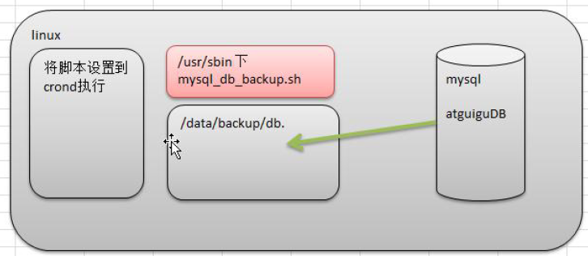

